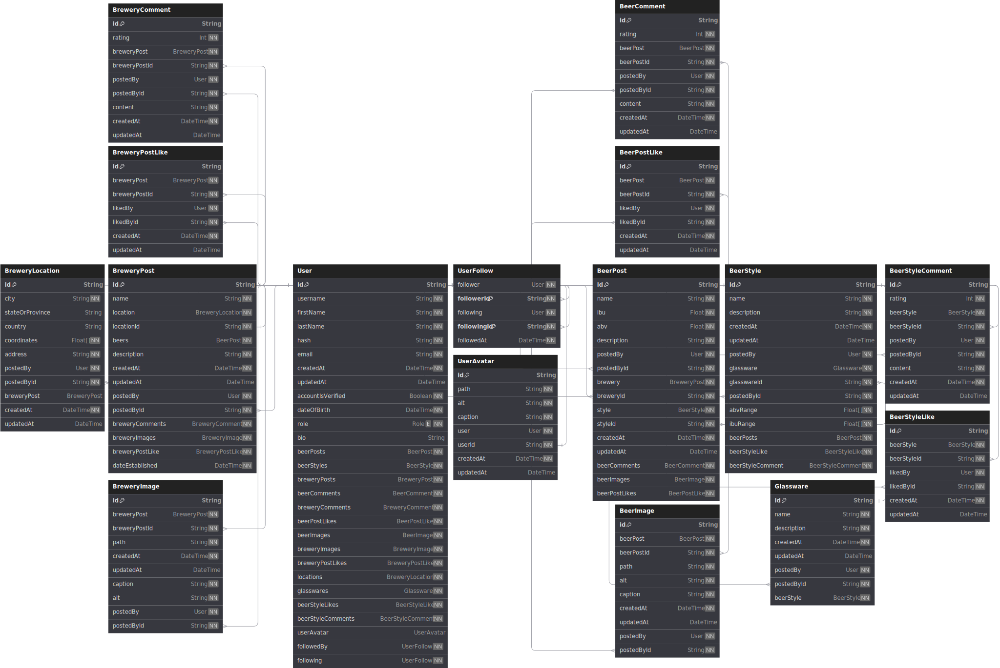

# The Biergarten App

## About

The Biergarten App is a web application designed for beer lovers to share their favorite
brews and breweries with like-minded people online.

This application's stack consists of Next.js, Prisma and Neon Postgres. I'm motivated to
learn more about these technologies while exploring my passion for beer.

I've also incorporated different APIs into the application, such as the Cloudinary API for
image uploading, the SparkPost API for email services as well as Mapbox for geolocation
and map data.

To handle serverless functions (API routes), I use the next-connect package.

On the client-side, I use Tailwind CSS, Headless UI and Daisy UI for styling to create a
visually appealing and user-friendly interface.

I'm sharing my code publicly so that others can learn from it and use it as a reference
for their own projects.

### Some beer terminology

In this app you will encounter various beer related terms. Here is a list of terms used in
this app and their definitions.

#### ABV

[Alcohol by volume](https://en.wikipedia.org/wiki/Alcohol_by_volume) (abbreviated as ABV)
is a standard measure of how much alcohol (ethanol) is contained in a given volume of an
alcoholic beverage (expressed as a volume percent).

#### IBU

The
[International Bitterness Units](https://en.wikipedia.org/wiki/Beer_measurement#Bitterness)
scale, or IBU, is used to approximately quantify the bitterness of beer. This scale is not
measured on the perceived bitterness of the beer, but rather the amount of a component of
beer known as iso-alpha acids.

## Database Schema



## Technologies

### General

- [Next.js](https://nextjs.org/)
  - A React based framework for building web applications offering several features such
    as server side rendering, static site generation and API routes.

### Client

- [SWR](https://swr.vercel.app/)
  - A React Hooks library for fetching data with support for caching, revalidation and
    error handling.
- [Tailwind CSS](https://tailwindcss.com/)
  - A popular open-source utility-first CSS framework that provides pre-defined classes to
    style HTML elements.
- [Headless UI](https://headlessui.dev/)
  - A set of completely unstyled, fully accessible UI components, designed to integrate
    beautifully with Tailwind CSS.
- [Daisy UI](https://daisyui.com/)
  - A component library for Tailwind CSS that provides ready-to-use components for
    building user interfaces.

### Server

- [Prisma](https://www.prisma.io/)
  - An open-source ORM for Node.js and TypeScript applications.
- [Neon Postgres](https://neon.tech/)
  - A managed PostgreSQL database service powered by Neon.
- [Cloudinary](https://cloudinary.com/)
  - A cloud-based image and video management service that provides developers with an easy
    way to upload, store, and manipulate media assets.
- [SparkPost](https://www.sparkpost.com/)
  - A cloud-based email delivery service that provides developers with an easy way to send
    transactional and marketing emails.
- [Mapbox](https://www.mapbox.com/)
  - A suite of open-source mapping tools that allows developers to add custom maps,
    search, and navigation into their applications.
- [next-connect](https://github.com/hoangvvo/next-connect#readme)
  - A promise-based method routing and middleware layer for Next.js.

## How to run locally

### Prerequisites

Before you can run this application locally, you will need to have the following installed
on your machine:

- [Node.js](https://nodejs.org/en/)
- [npm (version 8 or higher)](https://www.npmjs.com/get-npm)

You will also need to create a free account with the following services:

- [Cloudinary](https://cloudinary.com/users/register/free)
- [SparkPost](https://www.sparkpost.com/)
- [Neon Postgres](https://neon.tech/)
- [Mapbox](https://account.mapbox.com/auth/signup/)

### Setup

1. Clone this repository and navigate to the project directory.

```bash
git clone https://github.com/aaronpo97/the-biergarten-app
cd the-biergarten-app
```

2. Run the following command to install the dependencies.

```bash
npm install
```

3. Run the following script to create a `.env` file in the root directory of the project
   and add the following environment variables. Update these variables with your own
   values.

```bash
echo "BASE_URL=
CLOUDINARY_CLOUD_NAME=
CLOUDINARY_KEY=
CLOUDINARY_SECRET=
CONFIRMATION_TOKEN_SECRET=
SESSION_SECRET=
SESSION_TOKEN_NAME=
SESSION_MAX_AGE=
NODE_ENV=

POSTGRES_PRISMA_URL=
POSTGRES_URL_NON_POOLING=
SHADOW_DATABASE_URL=

MAPBOX_ACCESS_TOKEN=
NEXT_PUBLIC_MAPBOX_ACCESS_TOKEN=
SPARKPOST_API_KEY=
SPARKPOST_SENDER_ADDRESS=" > .env
```

### Explanation of environment variables

- `BASE_URL` is the base URL of the application.
  - For example, if you are running the application locally, you can set this to
    `http://localhost:3000`.
- `CLOUDINARY_CLOUD_NAME`, `CLOUDINARY_KEY`, and `CLOUDINARY_SECRET` are the credentials
  for your Cloudinary account.
  - You can create a free account [here](https://cloudinary.com/users/register/free).
- `CONFIRMATION_TOKEN_SECRET` is the secret used to sign the confirmation token used for
  email confirmation.
  - You can generate a random string using the`openssl rand -base64 127` command.
- `SESSION_SECRET` is the secret used to sign the session cookie.
  - Use the same command as above to generate a random string.
- `SESSION_TOKEN_NAME` is the name of the session cookie.
  - You can set this to `biergarten`.
- `SESSION_MAX_AGE` is the maximum age of the session cookie in milliseconds.
  - You can set this to `604800000` (1 week).
- `POSTGRES_PRISMA_URL`is a pooled connection string for your Neon Postgres database.
- `POSTGRES_URL_NON_POOLING` is a non-pooled connection string for your Neon Postgres
  database used for migrations.
- `SHADOW_DATABASE_URL` is a connection string for a secondary database used for
  migrations to detect schema drift.
  - You can create a free account [here](https://neon.tech).
  - Consult the [docs](https://neon.tech/docs/guides/prisma) for more information.
- `MAPBOX_ACCESS_TOKEN` and `NEXT_PUBLIC_MAPBOX_ACCESS_TOKEN` are the access tokens for
  your Mapbox account.
  - You can create a free account [here](https://account.mapbox.com/auth/signup/).
  - You will need to create two access tokens, one for the server-side and one for the
    client-side.
- `NODE_ENV` is the environment in which the application is running.
  - You can set this to `development` or `production`.
- `SPARKPOST_API_KEY` is the API key for your SparkPost account.
  - You can create a free account [here](https://www.sparkpost.com/).
- `SPARKPOST_SENDER_ADDRESS` is the email address that will be used to send emails.

1. Initialize the database and run the migrations.

```bash
npx prisma generate
npx prisma migrate dev
```

5. Seed the database with some initial data.

```bash
npm run seed
```

6. Start the application.

```bash
npm run dev
```

## License

The Biergarten App is licensed under the GNU General Public License v3.0. This means that
anyone is free to use, modify, and distribute the code as long as they also distribute
their modifications under the same license.

I encourage anyone who uses this code for educational purposes to attribute me as the
original author, and to provide a link to this repository.

By contributing to this repository, you agree to license your contributions under the same
license as the project.

If you have any questions or concerns about the license, please feel free to submit an
issue to this repository.

I hope that this project will be useful to other developers and beer enthusiasts who are
interested in learning about web development with Next.js, Prisma, Postgres, and other
technologies.
