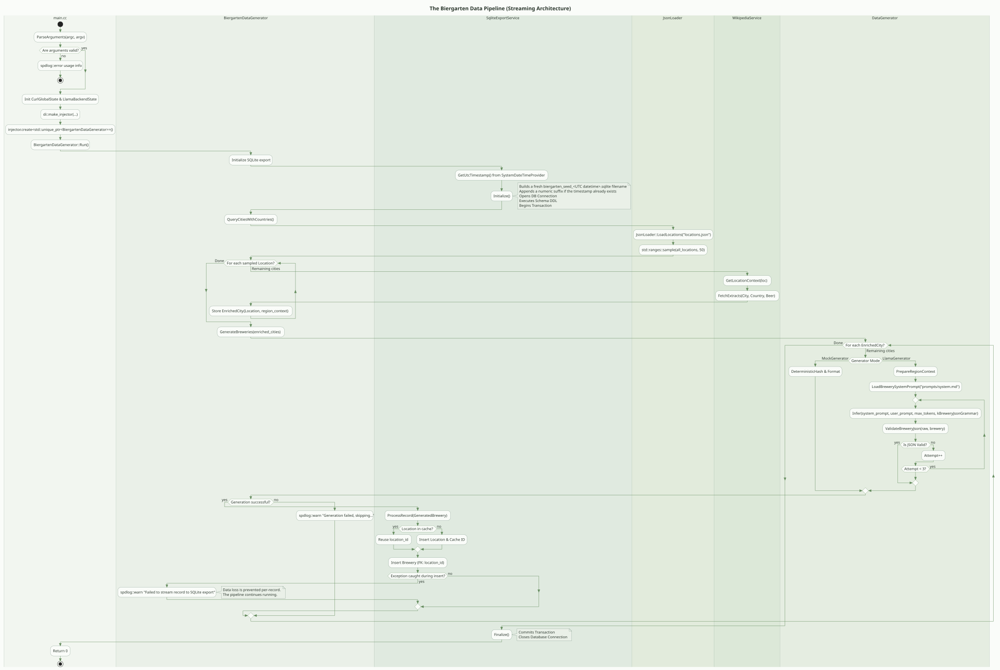
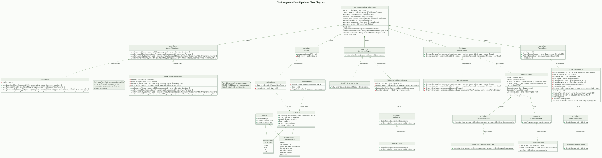

# Biergarten Pipeline

A C++20 command-line pipeline that samples city records from local JSON,
enriches each with Wikipedia context, and generates bilingual brewery names and
descriptions via a local GGUF model or a deterministic mock.

> **This pipeline produces AI-generated data.** It is not a source of truth for
> brewing techniques, cultural representation, or local-language accuracy. See
> [ETHICS-AND-KNOWN-ISSUES.md](./ETHICS-AND-KNOWN-ISSUES.md) for a full
> documentation of limitations, hallucination patterns, and bias.

---

## Table of Contents

- [How It Fits The Main App](#how-it-fits-the-main-app)
- [Quick Start](#quick-start)
  - [Build](#build)
  - [Model](#model)
  - [Run](#run)
- [Architecture](#architecture)
  - [Pipeline Stages](#pipeline-stages)
  - [Key Components](#key-components)
  - [Runtime Behaviour](#runtime-behaviour)
- [Generated Output](#generated-output)
- [Tech Stack](#tech-stack)
- [Tested Hardware](#tested-hardware)
- [Fixture Strategy](#fixture-strategy)
- [Repo Layout](#repo-layout)
- [Code Tour](#code-tour)
- [Next Steps](#next-steps)

---

## How It Fits The Main App

The pipeline is a data ingestion layer. It sits outside the web app runtime and
produces seed records the app imports at startup or during a dedicated seed
step.

| Planned app area                 | Pipeline contribution                                              |
| -------------------------------- | ------------------------------------------------------------------ |
| Brewery discovery and management | Sampled city records, localized names, long-form descriptions      |
| Beer reviews and ratings         | Stable brewery fixtures with enough context to anchor review pages |
| Social follow relationships      | Repeatable brewery entities for feeds, follows, and saved lists    |
| Geospatial brewery experiences   | Latitude, longitude, and country-level metadata                    |

---

## Quick Start

### Build

Requirements: C++20 compiler, CMake 3.24+, libcurl, Boost (JSON and
ProgramOptions). SQLite is fetched from the upstream amalgamation, so no system
SQLite package is required.

```bash
cmake -S . -B build
cmake --build build
```

### Model

> Skip this step if you only need `--mocked`.

```bash
mkdir -p models
curl -L \
  -o models/google_gemma-4-E4B-it-Q6_K.gguf \
  https://huggingface.co/bartowski/google_gemma-4-E4B-it-GGUF/resolve/main/google_gemma-4-E4B-it-Q6_K.gguf?download=true
```

### Run

Run from `build/` so the copied `locations.json` and `prompts/` are available.
Each run also writes a fresh dated SQLite file such as
`biergarten_seed_2026-04-19T15-30-45.123456Z.sqlite` into the working directory.

```bash
./biergarten-pipeline --mocked
./biergarten-pipeline --model models/google_gemma-4-E4B-it-Q6_K.gguf --temperature 1.0 --top-p 0.95 --top-k 64 --n-ctx 8192 --seed -1
```

#### CLI Flags

| Flag            | Purpose                                                 |
| --------------- | ------------------------------------------------------- |
| `--mocked`      | Deterministic mock generator, no model required.        |
| `--model, -m`   | Path to a GGUF file. Required unless `--mocked` is set. |
| `--temperature` | Sampling temperature. Default: `1.0`.                   |
| `--top-p`       | Nucleus sampling. Default: `0.95`.                      |
| `--top-k`       | Top-k sampling. Default: `64`.                          |
| `--n-ctx`       | Context window size. Default: `8192`.                   |
| `--seed`        | Random seed. Default: `-1` (random at runtime).         |
| `--help, -h`    | Print usage and exit.                                   |

`--mocked` and `--model` are mutually exclusive. Omitting both exits with an
error before the pipeline starts. Sampling flags are ignored when `--mocked` is
set.

The post-build step copies `prompts/` into `build/prompts/`. Rebuild after
editing `prompts/system.md`.

---

## Architecture

### Pipeline Stages

| Stage    | Implementation                                                                                                                          |
| -------- | --------------------------------------------------------------------------------------------------------------------------------------- |
| Load     | `JsonLoader::LoadLocations()` reads `locations.json` into typed `Location` records.                                                     |
| Sample   | `BiergartenDataGenerator::QueryCitiesWithCountries()` samples up to 50 locations per run.                                               |
| Enrich   | `WikipediaService` fetches city and beer context. Keeps going when a lookup fails.                                                      |
| Generate | `MockGenerator` or `LlamaGenerator` produces brewery names and descriptions in English and the local language.                          |
| Store    | `SqliteExportService` writes each successful brewery into a fresh dated `.sqlite` database with normalized location and brewery tables. |
| Log      | `spdlog` writes results and warnings to the console.                                                                                    |

If enrichment or generation fails for a city, that city is skipped and the
pipeline continues.

### Key Components

- `src/main.cc` — argument parsing and Boost.DI composition root.
- `JsonLoader` — validates curated location input.
- `WikipediaService` — queries Wikipedia extracts, caches results, returns empty
  context on failure.
- `LlamaGenerator` — formats prompts for Gemma 4, validates JSON output, retries
  malformed responses up to three times. If output looks truncated, the retry
  raises the token budget before trying again.
- `MockGenerator` — stable hash-based output so the same city input always
  produces the same brewery.
- `SqliteExportService` — creates a dated SQLite file per run and persists each
  successful brewery into normalized tables.
- Brewery payloads include English and local-language name and description
  fields.

### Runtime Behaviour

`WikipediaService` queries city, country, and beer-related Wikipedia extracts
using its configured lookup, then caches the first successful response per query
string. The fetched extract text is included in the prompt as context for
generation.

`GetLocationContext()` returns an empty string when the web client is
unavailable or when lookup/parsing fails.

`LlamaGenerator` validates model output as structured JSON. The retry path
exists as a safety hatch for cases where the reasoning block consumes available
token budget and compresses the JSON output space. All runs to date have
produced valid output on the first pass; the path is kept for resilience.

`MockGenerator` uses stable hashes for repeatable output in demos and Storybook
runs.

### Process Flow - Activity Diagram



### Architectural Overview - Class Diagram



---

## Generated Output

Each successful run stores a `GeneratedBrewery` pair with the source location
and a `BreweryResult` payload. The same generated records are also written to a
fresh SQLite export file named with the current UTC timestamp.

| Field               | Meaning                                    |
| ------------------- | ------------------------------------------ |
| `name_en`           | Brewery name in English.                   |
| `description_en`    | Brewery description in English.            |
| `name_local`        | Brewery name in the local language.        |
| `description_local` | Brewery description in the local language. |

The log dump also includes city, country, state or province, ISO subdivision
code, latitude, and longitude for each entry.

### Consumer Data Shape

| Field                               | Why it matters                                   |
| ----------------------------------- | ------------------------------------------------ |
| `city`, `state_province`, `country` | Human-readable location labels and page headings |
| `iso3166_1`, `iso3166_2`            | Filtering, regional grouping, locale matching    |
| `latitude`, `longitude`             | Map pins and nearby brewery views                |
| `local_languages`                   | Locale-aware copy selection                      |
| `name_en`, `description_en`         | Default English display content                  |
| `name_local`, `description_local`   | Local-language display content                   |
| `region_context`                    | Richer copy for cards and detail pages           |

---

## Tech Stack

- C++20
- CMake 3.24+
- Boost.JSON, Boost.ProgramOptions, Boost.DI
- spdlog
- libcurl
- SQLite amalgamation fetched and compiled via CMake FetchContent
- llama.cpp

The build fetches Boost.DI, spdlog, llama.cpp, and SQLite via CMake. Metal is
enabled on Apple Silicon; CUDA or HIP/ROCm is detected on Linux when the toolkit
is present.

> **Code Style:** Modern C++20 throughout — RAII for ownership,
> `std::unique_ptr` for injected dependencies, `std::optional` for parse
> outcomes, `std::span` for read-only views over generated city data, structured
> bindings in pipeline loops. Formatting follows the Google C++ Style Guide via
> `.clang-format` with a narrow column limit and two-space indentation.

---

## Tested Hardware

### ARM macOS - M1 Pro

|           |                                   |
| --------- | --------------------------------- |
| Host      | MacBook Pro 14" (2021)            |
| CPU       | Apple M1 Pro (8-core)             |
| GPU       | Apple M1 Pro (14-core integrated) |
| Memory    | 16 GB                             |
| Model     | Gemma 4 E4B                       |
| Inference | llama.cpp with Metal              |

### x86_64 Linux - NVIDIA RTX 2000

|           |                                |
| --------- | ------------------------------ |
| Host      | ThinkPad P1 Gen 7 (Fedora 43)  |
| CPU       | Intel Core Ultra 7 155H        |
| GPU       | NVIDIA RTX 2000 Ada Generation |
| Memory    | 32 GB                          |
| Model     | Gemma 4 E4B                    |
| Inference | llama.cpp with CUDA 12.x       |

---

## Fixture Strategy

- `--mocked` for stable fixtures, repeatable screenshots, and Storybook runs.
- `--model` when geographically grounded content matters for demos.
- Keep `locations.json` structured enough to support discovery and future
  filtering.
- Treat SQLite output as seed material for the app's brewery domain, not
  production data.

---

## Repo Layout

| Path                         | Purpose                                            |
| ---------------------------- | -------------------------------------------------- |
| `includes/`                  | Public headers and shared models.                  |
| `src/`                       | Implementation files.                              |
| `locations.json`             | Curated city input copied into the build tree.     |
| `prompts/`                   | System prompt used by the model-backed path.       |
| `diagrams/`                  | Architecture and pipeline diagrams.                |
| `ETHICS-AND-KNOWN-ISSUES.md` | Ethics, bias, hallucination analysis, mitigations. |

---

## Code Tour

- `src/main.cc` — argument parsing and DI composition root.
- `src/biergarten_data_generator/` — orchestration, sampling, logging, and
  export.
- `src/services/wikipedia/` — enrichment service and cache.
- `src/services/sqlite/` — SQLite export implementation.
- `src/data_generation/llama/` — local inference, prompt loading, output
  validation.
- `src/data_generation/mock/` — deterministic fallback.

---

## Next Steps

The pipeline currently produces city-aware brewery records and dated SQLite
exports. The next passes add additional fixture types so the app can exercise
the full brewery domain without live data.

### Testing — Very High Priority

- Unit test JSON validation and retry logic against malformed, truncated, and
  empty model outputs.
- Integration test the enrichment pipeline with missing context, short context,
  and fake context inputs.
- Adversarial context tests: feed plausible but geographically incorrect
  Wikipedia extracts and verify the model does not silently blend them with
  training data.
- Verify bilingual enrichment behaviour when only an English extract is
  available versus when both extracts are present.
- Confirm the retry path is reachable when the reasoning block consumes
  available token budget.

### Beer Generation

Generate catalog entries with style, ABV, IBU, color, aroma notes, and food
pairing hints. Link beers back to breweries and cities. Keep style coverage wide
enough to exercise search, sort, and category filters.

### User Generation

Generate user profiles with stable names, bios, locale hints, and preference
signals. Include stable IDs for downstream fixture joins. Keep output
deterministic for screenshots while allowing larger randomized batches.

### Check-In System

Produce timestamped check-in events between users and breweries. Use a J-curve
activity profile — a small set of users accounts for most check-ins, the rest
appear occasionally. Add bursty behaviour around weekends and travel periods.

### Beer Ratings

Generate rating events with a strong positive skew and a long tail of lower
scores. Avoid uniform distributions. Attach timestamps and user IDs so the app
can compute averages, trends, and per-style comparisons.
