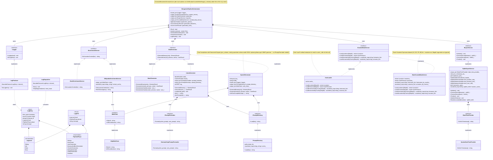

# The Biergarten Data Pipeline — Class Diagram (Current)

```mermaid
classDiagram
    class BiergartenPipelineOrchestrator {
        -shared_ptr~ILogger~ logger_
        -unique_ptr~IEnrichmentService~ context_service_
        -unique_ptr~DataGenerator~ generator_
        -unique_ptr~IExportService~ exporter_
        -unique_ptr~ICuratedDataService~ curated_data_service_
        -ApplicationOptions application_options_
        -vector~BreweryRecord~ generated_breweries_
        -vector~UserRecord~ generated_users_
        +Run() bool
        -QueryLocations() vector~City~
        -GenerateBreweries(cities) void
        -GenerateUsers(cities) void
        -LogResults() void
    }
    note for BiergartenPipelineOrchestrator "GenerateBreweries/GenerateUsers jitter each address via GetRandomCoordsWithinRange(), uniformly within 5km of the city centre"

    class LogLevel {
        <<enumeration>>
        Debug
        Info
        Warn
        Error
    }

    class PipelinePhase {
        <<enumeration>>
        Startup
        Enrichment
        UserGeneration
        BreweryAndBeerGeneration
        CheckinGeneration
        RatingGeneration
        FollowGeneration
        Teardown
    }

    class LogDTO {
        <<struct>>
        +LogLevel level
        +PipelinePhase phase
        +string message
    }

    class LogEntry {
        <<struct>>
        +time_point timestamp
        +source_location origin
        +thread::id thread_id
        +LogLevel level
        +PipelinePhase phase
        +string message
    }

    class ILogger {
        <<interface>>
        +Log(payload) void
        -DoLog(entry)* void
    }

    class LogProducer {
        -BoundedChannel~LogEntry~ channel_
        -DoLog(entry) void
    }

    class LogDispatcher {
        -BoundedChannel~LogEntry~ channel_
        +Run() void
        -ToSpdlogLevel(level) level_enum
    }

    class IEnrichmentService {
        <<interface>>
        +GetLocationContext(loc) string
    }

    class MockEnrichmentService {
        +GetLocationContext(loc) string
    }

    class WikipediaEnrichmentService {
        -unique_ptr~WebClient~ client_
        -unordered_map~string, string~ extract_cache_
        +GetLocationContext(loc) string
        -FetchExtract(query) string
    }

    class WebClient {
        <<interface>>
        +Get(url) string
        +UrlEncode(value) string
    }

    class HttpWebClient {
        +Get(url) string
        +UrlEncode(value) string
    }

    class DataGenerator {
        <<interface>>
        +GenerateBrewery(city) BreweryResult
        +GenerateUser(city, persona, name) UserResult
    }

    class MockGenerator {
        +GenerateBrewery(city) BreweryResult
        +GenerateUser(city, persona, name) UserResult
        -DeterministicHash(location) size_t
        -DeterministicHash(location, persona, name) size_t
    }

    class LlamaGenerator {
        -ModelHandle model_
        -ContextHandle context_
        -unique_ptr~IPromptFormatter~ prompt_formatter_
        -unique_ptr~IPromptDirectory~ prompt_directory_
        -mt19937 rng_
        +GenerateBrewery(...) BreweryResult
        +GenerateUser(...) UserResult
        -Load(model_path) void
        -Infer(...) string
        -InferFormatted(...) string
    }

    class OpenAIGenerator {
        -string api_key_
        -string model_
        -shared_ptr~ILogger~ logger_
        -unique_ptr~IPromptDirectory~ prompt_directory_
        -unique_ptr~WebClient~ web_client_
        +GenerateBrewery(city) BreweryResult
        +GenerateUser(city, persona, name) UserResult
        -CallChatCompletionsApi(...) string
    }
    note for OpenAIGenerator "Chat Completions with Structured Outputs (json_schema, strict) guarantees schema-valid JSON, replacing llama.cpp's GBNF grammar — no IPromptFormatter needed"

    class IPromptFormatter {
        <<interface>>
        +Format(system_prompt, user_prompt) string
    }

    class Gemma4JinjaPromptFormatter {
        +Format(system_prompt, user_prompt) string
    }

    class IPromptDirectory {
        <<interface>>
        +Load(key) string
    }

    class PromptDirectory {
        -path prompt_dir_
        -unordered_map~string, string~ cache_
        +Load(key) string
    }

    class ICuratedDataService {
        <<interface>>
        +LoadLocations(filepath) vector~Location~
        +LoadPersonas(filepath) vector~UserPersona~
        +LoadForenamesByCountry(filepath) unordered_map~string, forename_list~
        +LoadSurnamesByCountry(filepath) unordered_map~string, surname_list~
    }

    class JsonLoader {
        -cache cache_
        +LoadLocations(filepath) vector~Location~
        +LoadPersonas(filepath) vector~UserPersona~
        +LoadForenamesByCountry(filepath) unordered_map~string, forename_list~
        +LoadSurnamesByCountry(filepath) unordered_map~string, surname_list~
    }
    note for JsonLoader "Each Load* method memoizes its result in cache_ after its first call"

    class MockCuratedDataService {
        -vector~Location~ locations_
        -vector~UserPersona~ personas_
        -unordered_map~string, forename_list~ forenames_by_country_
        -unordered_map~string, surname_list~ surnames_by_country_
        +LoadLocations(filepath) vector~Location~
        +LoadPersonas(filepath) vector~UserPersona~
        +LoadForenamesByCountry(filepath) unordered_map~string, forename_list~
        +LoadSurnamesByCountry(filepath) unordered_map~string, surname_list~
    }
    note for MockCuratedDataService "Fixed 4-location/3-persona dataset (US, DE, FR, BE) for --mocked runs; filepath arguments are ignored"

    class IExportService {
        <<interface>>
        +Initialize() void
        +ProcessRecord(brewery) uint64_t
        +ProcessRecord(user) uint64_t
        +Finalize() void
    }

    class SqliteExportService {
        -unique_ptr~IDateTimeProvider~ date_time_provider_
        -string run_timestamp_utc_
        -path database_path_
        -SqliteDatabaseHandle db_handle_
        -SqliteStatementHandle insert_location_stmt_
        -SqliteStatementHandle insert_brewery_stmt_
        -SqliteStatementHandle insert_user_stmt_
        -bool transaction_open_
        -unordered_map~string, sqlite3_int64~ location_cache_
        +Initialize() void
        +ProcessRecord(brewery) uint64_t
        +ProcessRecord(user) uint64_t
        +Finalize() void
        -InitializeSchema() void
        -ResolveLocationId(location) sqlite3_int64
    }

    class IDateTimeProvider {
        <<interface>>
        +GetUtcTimestamp() string
    }

    class SystemDateTimeProvider {
        +GetUtcTimestamp() string
    }

    BiergartenPipelineOrchestrator *-- ILogger : owns
    BiergartenPipelineOrchestrator *-- IEnrichmentService : owns
    BiergartenPipelineOrchestrator *-- DataGenerator : owns
    BiergartenPipelineOrchestrator *-- IExportService : owns
    BiergartenPipelineOrchestrator *-- ICuratedDataService : owns

    LogEntry *-- LogLevel
    LogEntry *-- PipelinePhase
    LogDTO *-- LogLevel
    LogDTO *-- PipelinePhase
    ILogger <|.. LogProducer : implements
    LogProducer ..> LogEntry : emits
    LogDispatcher ..> LogEntry : consumes

    IEnrichmentService <|.. WikipediaEnrichmentService : implements
    IEnrichmentService <|.. MockEnrichmentService : implements
    WikipediaEnrichmentService *-- WebClient : owns

    WebClient <|.. HttpWebClient : implements

    DataGenerator <|.. MockGenerator : implements
    DataGenerator <|.. LlamaGenerator : implements
    DataGenerator <|.. OpenAIGenerator : implements

    LlamaGenerator *-- IPromptFormatter : uses
    LlamaGenerator *-- IPromptDirectory : uses

    OpenAIGenerator *-- IPromptDirectory : uses
    OpenAIGenerator *-- WebClient : uses

    IPromptFormatter <|.. Gemma4JinjaPromptFormatter : implements
    IPromptDirectory <|.. PromptDirectory : implements

    ICuratedDataService <|.. JsonLoader : implements
    ICuratedDataService <|.. MockCuratedDataService : implements

    IExportService <|.. SqliteExportService : implements
    SqliteExportService *-- IDateTimeProvider : owns
    IDateTimeProvider <|.. SystemDateTimeProvider : implements
```
