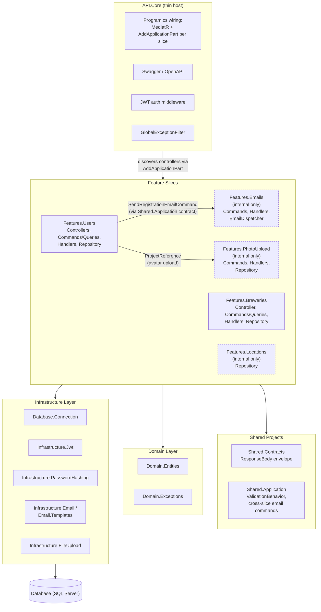
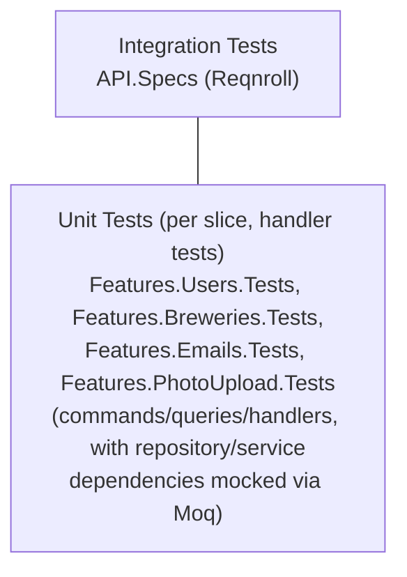

# Architecture

This document describes the architecture of The Biergarten App.

## High-level overview

The Biergarten App is a monorepo split between the backend and the website:

- **Backend**: .NET 10 Web API with SQL Server, organized as vertical feature
  slices with MediatR
- **Frontend**: React 19 + React Router 8 website in `web/frontend`
- **Architecture Style**: Vertical-slice backend plus server-rendered React
  frontend

`archive/next-js-web-app/` contains an archived Next.js frontend, kept for
reference.

## Diagrams

For visual representations, see:

- [Vertical Slice](diagrams/vertical-slice.md) - host wiring and project
  reference diagrams
- [Deployment](diagrams/deployment.md) - Docker deployment diagram
- [Database Schema](diagrams/database-schema.md) - database relationships

Authentication workflow diagrams, one per flow, under
[`diagrams/auth/`](diagrams/auth/):

- [Registration](diagrams/auth/registration.md)
- [Login](diagrams/auth/login.md)
- [Refresh Token](diagrams/auth/refresh-token.md)
- [Confirm User](diagrams/auth/confirm-user.md)
- [Resend Confirmation](diagrams/auth/resend-confirmation.md)
- [Update Username](diagrams/auth/update-username.md)
- [Update Email](diagrams/auth/update-email.md)
- [Update Password](diagrams/auth/update-password.md)
- [Update Profile](diagrams/auth/update-profile.md)
- [Delete Account](diagrams/auth/delete-account.md)
- [Error Handling](diagrams/auth/error-handling.md) - shared
  `GlobalExceptionFilter` mapping used by all flows above

## Backend architecture

### Vertical-slice architecture pattern

The backend organizes business capabilities as feature slices instead of
technical layers.

Each feature (`Features.Users`, `Features.Breweries`, `Features.Emails`,
`Features.Locations`, `Features.PhotoUpload`) is a single project that owns its
own MediatR commands/queries/handlers, validators, and repository end to end.

`Features.Emails`, `Features.Locations`, and `Features.PhotoUpload` have no
`Controllers/` folder; all three are invoked internally by other slices via
MediatR/DI, never over HTTP:



### Layer responsibilities

#### API layer (`API.Core`)

**Purpose**: Thin ASP.NET Core host: no business logic, no controllers of its
own

**Components**:

| Component                                             | Description                                                                                                                                                  |
| ----------------------------------------------------- | ------------------------------------------------------------------------------------------------------------------------------------------------------------ |
| `Program.cs`                                          | Thin composition root: builds the host and calls the `ServiceCollectionExtensions` methods below.                                                            |
| `ServiceCollectionExtensions.cs`                      | Registers MediatR (scanning every `Features.*` assembly), FluentValidation, and uses `AddApplicationPart` so each slice's controllers are discovered by MVC. |
| `GlobalException.cs`                                  | Global exception filter (host-level cross-cutting concern).                                                                                                  |
| `Authentication/JwtAuthenticationHandler.cs`          | JWT auth scheme middleware.                                                                                                                                  |
| Swagger/OpenAPI documentation, health check endpoints | Host-level documentation and health endpoints.                                                                                                               |

**Dependencies**:

- Every `Features.*` project (for controller/MediatR discovery)
- `Shared.Contracts`, `Shared.Application`
- `Infrastructure.Jwt` (for the auth middleware)

**Rules**:

- No controllers, no business logic, no feature-specific contracts
- Exists purely to host and wire up the feature slices

#### Feature slices (`Features.Users`, `Features.Breweries`, `Features.Emails`, `Features.Locations`, `Features.PhotoUpload`)

**Purpose**: Each slice is the complete vertical for one business capability

**Components** (per slice):

| Component                                          | Description                                                                                                                                |
| -------------------------------------------------- | ------------------------------------------------------------------------------------------------------------------------------------------ |
| `Controllers/`                                     | HTTP endpoints, binding directly to Command/Query types as the request contract                                                            |
| `Commands/<Operation>/` and `Queries/<Operation>/` | One folder per operation, each containing the Command/Query record, its `IRequestHandler`, and (for commands) a FluentValidation validator |
| `Repository/`                                      | The slice's own Dapper repository implementation                                                                                           |
| `Dtos/`                                            | Response shapes returned by query handlers (never the raw domain entity)                                                                   |
| `DependencyInjection/`                             | An `AddFeaturesX()` extension method registering the slice's repository/services                                                           |

##### Note

`Features.Emails` has no `Controllers/` folder. It's invoked only via MediatR
commands sent from other slices, never over HTTP.

`Features.PhotoUpload` also has no `Controllers/` folder; its
`UploadPhotoCommand` is sent by other features' handlers (for example, a future
brewery photo upload command) rather than bound to an HTTP route directly.

**Dependencies**:

- `Domain.Entities`, `Domain.Exceptions`
- `Database.Connection` (generic ADO.NET connection/command plumbing) plus
  whichever infrastructure project the slice needs (`Infrastructure.Jwt`/
  `Infrastructure.PasswordHashing` for Users, `Infrastructure.Email`/
  `Infrastructure.Email.Templates` for Emails, `Infrastructure.FileUpload` for
  PhotoUpload)
- `Shared.Contracts`, `Shared.Application`
- No other `Features.*` project, with one exception: `Features.Users` references
  `Features.PhotoUpload` directly for avatar uploads

**Rules**:

- All business logic for that feature lives in its command/query handlers
- No direct controller-to-repository calls; everything flows through MediatR
- Read endpoints return a dedicated `Dto`, never the domain entity directly

#### Shared projects (`Shared.Contracts`, `Shared.Application`)

**Purpose**: The minimum cross-slice surface area required because every slice
needs it, or because duplicating it four times would be worse than sharing it

**Components**:

| Project              | Purpose                                                                                                                                                                                                                                 |
| -------------------- | --------------------------------------------------------------------------------------------------------------------------------------------------------------------------------------------------------------------------------------- |
| `Shared.Contracts`   | `ResponseBody<T>`/`ResponseBody`, the API response envelope every controller returns                                                                                                                                                    |
| `Shared.Application` | `ValidationBehavior<TRequest,TResponse>` (the MediatR pipeline behavior that runs FluentValidation before a handler executes) and the cross-slice email commands (`SendRegistrationEmailCommand`, `SendResendConfirmationEmailCommand`) |

**Rules**:

- Kept deliberately small: this is the exception to "no slice depends on another
  slice".

#### Infrastructure layer

**Purpose**: Technical capabilities and external integrations, shared by
whichever slices need them

**Components**:

| Project                          | Description                                                                                                                                                                                                                                                                |
| -------------------------------- | -------------------------------------------------------------------------------------------------------------------------------------------------------------------------------------------------------------------------------------------------------------------------- |
| `Database.Connection`            | Generic ADO.NET connection/command plumbing (`DefaultSqlConnectionFactory`, the abstract `DapperRepository` base class), not domain-specific; each slice's own `Repository/` folder builds on this.                                                                        |
| `Infrastructure.Jwt`             | JWT token generation and validation.                                                                                                                                                                                                                                       |
| `Infrastructure.PasswordHashing` | Argon2id password hashing.                                                                                                                                                                                                                                                 |
| `Infrastructure.Email`           | Email sending capabilities (SMTP/MailKit).                                                                                                                                                                                                                                 |
| `Infrastructure.Email.Templates` | Email template rendering (Razor components).                                                                                                                                                                                                                               |
| `Infrastructure.FileUpload`      | `IFileStorageProvider` abstraction over S3-compatible object storage, implemented by `S3FileStorageProvider` (targets the SeaweedFS container in dev; any S3-compatible endpoint in other environments) using the AWS SDK's `AmazonS3Client` with `ForcePathStyle = true`. |

**Dependencies**:

- Domain entities
- External libraries (ADO.NET, JWT, Argon2, MailKit, AWSSDK.S3, and so on)

**Rules**:

- Implements technical concerns only, no business logic
- Reusable across slices

#### Domain layer (`Domain.Entities`)

**Purpose**: Core business entities and models

**Components**:

| Entity                | Description                                                                                        |
| --------------------- | -------------------------------------------------------------------------------------------------- |
| `UserAccount`         | User profile data.                                                                                 |
| `UserCredential`      | Authentication credentials.                                                                        |
| `UserVerification`    | Account verification state.                                                                        |
| `BreweryPost`         | A user-submitted brewery listing.                                                                  |
| `BreweryPostLocation` | A brewery's address and coordinates.                                                               |
| `City`                | A city referenced by a brewery location.                                                           |
| `StateProvince`       | A state/province referenced by a city.                                                             |
| `Country`             | A country referenced by a state/province.                                                          |
| `BeerStyle`           | A beer style/category (schema table exists; no repository yet).                                    |
| `BeerPost`            | A beer listing tied to a brewery and style (schema table exists; no repository yet).               |
| `Photo`               | A photo uploaded by a user account, written via `Features.PhotoUpload`'s `IPhotoUploadRepository`. |

**Dependencies**:

- None (pure domain)

**Rules**:

- Plain Old CLR Objects (POCOs)
- No framework dependencies
- No infrastructure references
- Represents business concepts

### Design patterns

#### Vertical slice + MediatR

**Purpose**: Organize code by feature instead of by technical layer, so
everything needed to understand or change one capability lives in one project

**Implementation**:

- Each HTTP write operation is a `Command` (for example, `CreateBreweryCommand`
  in `Features.Breweries/Commands/CreateBrewery/`); each read operation is a
  `Query` (for example, `GetBreweryByIdQuery`)
- Controllers generally bind directly to the Command/Query as the request body;
  there is no separate request DTO + mapping step for writes
  - The exception to this is for authenticated routes, when the current user id
    needs to be extracted from the authentication token to be used in a command.
- A single shared `ValidationBehavior<TRequest,TResponse>`
  (`Shared.Application/Behaviors/`) runs FluentValidation validators in the
  MediatR pipeline before any handler executes
- Query handlers map to a dedicated response `Dto`, so domain entities never
  leak

**Example**:

```csharp
public record CreateBreweryCommand(Guid PostedById, string BreweryName, string Description, ...)
    : IRequest<BreweryDto>;

public class CreateBreweryHandler(IBreweryRepository repository) : IRequestHandler<CreateBreweryCommand, BreweryDto>
{
    public async Task<BreweryDto> Handle(CreateBreweryCommand request, CancellationToken cancellationToken) { ... }
}
```

#### Repository pattern

**Purpose**: Abstract database access behind interfaces

**Implementation**: each slice owns its own repository, scoped to that feature
only:

- `Features.Users/Repository/IUserListRepository.cs`,
  `Features.Users/Repository/IUserProfileRepository.cs`
- `Features.Breweries/Repository/IBreweryRepository.cs`
- `Features.PhotoUpload/Repository/IPhotoUploadRepository.cs`
- `Database.Connection/DefaultSqlConnectionFactory.cs`: the generic connection
  factory every slice's repository builds on
- `Database.Connection/DapperRepository.cs`: shared abstract base class every
  repository extends, providing `CreateConnection()` and a
  `RollbackQuietlyAsync()` helper that rolls back a transaction while swallowing
  any exception the rollback itself raises, so the exception that triggered the
  rollback is what propagates

**Benefits**:

- Testable (easy to mock)
- Each slice's data access logic is self-contained

**Example**:

```csharp
public interface IUserListRepository
{
    Task<UserAccount?> GetByIdAsync(Guid id);
    Task<IEnumerable<UserAccount>> GetAllAsync(int? limit, int? offset);
}
```

#### Dependency injection

**Purpose**: Loose coupling and testability

**Configuration**: `Program.cs` wires up MediatR/FluentValidation across every
`Features.*` assembly; each slice exposes its own `AddFeaturesX()` extension
method that registers its repository and slice-internal services

**Lifetimes**:

- Scoped: Repositories, slice-internal services (per request)
- Singleton: `DefaultSqlConnectionFactory`
- Transient: Utilities, helpers

#### Direct SQL via Dapper/ADO.NET

**Purpose**: Keep data access explicit and colocated with the slice that owns it

**Strategy**:

- Each repository issues inline SQL through Dapper, which handles parameter
  binding.
- Proximity search (`GET /api/brewery/locations/nearby`) filters and orders rows
  server-side with `Coordinates.STDistance(@Origin) <= @RangeInMetres`, avoiding
  a client-side distance calculation over every row.
- Referential checks (for example, "does this `CityId` exist?") are explicit
  `SELECT 1 ...` existence checks in the repository method, run inside the same
  transaction as the write
- Optimistic concurrency uses each table's `RowVersion` (`ROWVERSION`) column,
  checked in the `UPDATE ... WHERE ... AND RowVersion = @RowVersion` clause
- Repositories throw `Domain.Exceptions` types (`NotFoundException`,
  `ConflictException`, ...) directly when a check fails; `API.Core`'s
  `GlobalExceptionFilter` maps those exception types to HTTP status codes
- Application focuses on orchestration; the database enforces integrity via
  keys, `CHECK` constraints, and cascades

See [Database](database.md) for the schema and the app's SQL error-handling
approach in more detail.

## Frontend architecture

### Website (`web/frontend`)

The website is a React Router 8 application with server-side rendering enabled.

```text
web/frontend/
├── app/
│   ├── components/      Shared UI: Navbar, FormField, SubmitButton, ToastProvider,
│   │                    RouteErrorState, ClientOnly (defers client-only children,
│   │                    for example Leaflet maps, past hydration)
│   ├── features/        One folder per feature slice, each owning its own
│   │                    routes/, components/, hooks/, schemas, and server-side
│   │                    loader helpers:
│   │                      - account    profile/dashboard management
│   │                      - auth       login, register, confirm, logout
│   │                      - breweries  index/directory/detail routes, Leaflet
│   │                                   map components, nearby-search resource
│   │                                   route, distance/address utils
│   │                      - catalog    beers, beer styles
│   │                      - home       landing page
│   │                      - theme      theme switcher/guide
│   ├── hooks/            Shared hooks not tied to one feature, for example useMediaQuery
│   ├── routes.ts         Route table (React Router 8 config-based routing)
│   ├── root.tsx          App shell and global providers
│   └── app.css           Theme tokens and global styling
├── .storybook/          Storybook config and preview setup
├── stories/             Storybook stories for shared UI and themes
├── tests/playwright/    Storybook Playwright coverage
└── package.json         Frontend scripts and dependencies
```

### Frontend responsibilities

- Render brewery discovery routes (`/breweries` index, `/breweries/directory`,
  `/breweries/:id`) with Leaflet-powered maps and geolocation-based "nearby"
  search
- Render the auth demo, account dashboard, and theme guide routes
- Manage cookie-backed website session state
- Call the .NET API for login, registration, token refresh, confirmation, and
  brewery/location data
- Provide shared UI building blocks for forms, navigation, themes, and toasts
- Supply Storybook documentation and browser-based component verification

### Theme system

The website uses semantic DaisyUI theme tokens backed by four Biergarten themes:

- Biergarten Lager
- Biergarten Stout
- Biergarten Cassis
- Biergarten Weizen

All component styling should prefer semantic tokens such as `primary`,
`success`, `surface`, and `highlight` instead of hard-coded color values.

### Archived frontend

`archive/next-js-web-app/` contains an archived Next.js frontend, kept for
reference. Product and engineering documentation points to `web/frontend`.

## Security architecture

### Authentication flow

| Flow                   | Details                                                                                                                                                                                                                                                           |
| ---------------------- | ----------------------------------------------------------------------------------------------------------------------------------------------------------------------------------------------------------------------------------------------------------------- |
| **Registration**       | User submits credentials; password is hashed with Argon2id; user account is created as unverified and a confirmation email is dispatched via `Features.Emails`.                                                                                                   |
| **Email confirmation** | User follows the confirmation link/token from the email; `Features.Users`' `ConfirmUser` command marks the account as verified.                                                                                                                                   |
| **Login**              | User submits credentials; password is verified against the hash; access and refresh JWTs are issued and returned to the client; neither is stored server-side.                                                                                                    |
| **Token refresh**      | Client exchanges a valid, unexpired refresh token for a new access/refresh pair via `Features.Users`' `RefreshToken` command; refresh tokens are stateless JWTs, not tracked server-side, and the previous refresh token remains usable until its own expiration. |
| **API requests**       | Client sends the access JWT in the `Authorization` header; `JwtAuthenticationHandler` validates the token; request proceeds if valid.                                                                                                                             |

### Password security

**Algorithm**: Argon2id

| Setting     | Value                                          |
| ----------- | ---------------------------------------------- |
| Memory      | 64MB                                           |
| Iterations  | 4                                              |
| Parallelism | 2 (hardcoded, to avoid thread-pool exhaustion) |
| Salt        | 128-bit (16 bytes)                             |
| Hash        | 256-bit (32 bytes)                             |

### JWT tokens

**Algorithm**: HS256 (HMAC-SHA256)

**Claims**:

| Claim         | Meaning              |
| ------------- | -------------------- |
| `sub`         | User ID              |
| `unique_name` | Username             |
| `jti`         | Unique token ID      |
| `iat`         | Issued at timestamp  |
| `exp`         | Expiration timestamp |

**Configuration** (appsettings.json):

```json
{
  "Jwt": {
    "ExpirationMinutes": 60,
    "Issuer": "biergarten-api",
    "Audience": "biergarten-users"
  }
}
```

This block exists in `appsettings.json`, but nothing in the code currently reads
it: actual token lifetimes come from the hardcoded `TokenServiceExpirationHours`
constants, and `JwtInfrastructure` hardcodes `ValidateIssuer`/`ValidateAudience`
to `false`, so `Issuer`/`Audience` are not enforced.

## Database architecture

For the table-by-table schema and the custom SQL error code scheme, see
[Database](database.md).

### SQL-first philosophy

**Principles**:

1. Database is source of truth
2. Queries live in the owning repository, not scattered across the app
3. Database handles referential integrity
4. Application orchestrates, database executes

**Benefits**:

- Performance optimization via execution plans
- Query logic scoped to the repository that owns it, not spread across layers
- Version-controlled schema (migrations)
- Easier query profiling and tuning

### Migration strategy

**Tool**: DbUp

**Process**:

1. Write a SQL script under `Database.Migrations/scripts/`
2. Embed it in the `Database.Migrations` project
3. `Database.Migrations` runs each script against the target database on
   startup, tracked so a script never re-runs once applied

**Migration Files**:

```
scripts/
└── 01-schema/
    ├── 01-UserAccount.sql
    ├── 02-Photo.sql
    ├── ...
    ├── 16-UserProfile.sql
    └── 17-UserAvatar.sql        # one script per CREATE TABLE
```

Each table has its own script, numbered so a table's foreign keys always point
at an earlier-numbered script. As the schema evolves, new numbered scripts get
added rather than editing an existing one in place, so DbUp's already-applied
tracking stays valid.

### Data seeding

**Purpose**: Populate development/test databases with realistic data

**Implementation**: `Database.Seed` project, using data produced by the C++
pipeline under `tooling/pipeline/` (see
[Pipeline README](../pipeline/README.md))

**Seed Data**:

- Countries, state/provinces, and cities (via `Features.Locations`'
  `ILocationRepository`, which creates `Country`/`StateProvince` rows on demand
  while resolving a city)
- User accounts (via `Features.Users`' repository)
- Brewery posts with locations (via `Features.Breweries`' repository)

Tables that exist in the schema but have no repository yet ( `UserFollow`,
`BeerStyle`, `BeerPost`, `BeerPostPhoto`, `BeerPostComment`, `BreweryPostPhoto`)
are not seeded either.

## Deployment architecture

### Docker containerization

**Container Structure**:

| Container             | Purpose                                                      |
| --------------------- | ------------------------------------------------------------ |
| `sqlserver`           | SQL Server 2022                                              |
| `database.migrations` | Schema migration runner                                      |
| `database.seed`       | Data seeder                                                  |
| `api.core`            | ASP.NET Core Web API                                         |
| `mailpit`             | Local dev/test SMTP server + web UI (not used in production) |
| `seaweedfs`           | S3-compatible object storage for uploaded photos (dev only)  |

**Environments**:

| Environment | Compose file               |
| ----------- | -------------------------- |
| Development | `docker-compose.dev.yaml`  |
| Testing     | `docker-compose.test.yaml` |
| Production  | `docker-compose.prod.yaml` |

For details, see [Docker Guide](docker.md).

### Health checks

- **SQL Server**: Validates database connectivity
- **API**: Checks service health and dependencies

**Configuration**:

```yaml
healthcheck:
  test: ["CMD-SHELL", "sqlcmd health check"]
  interval: 10s
  retries: 12
  start_period: 30s
```

## Testing architecture

### Test pyramid



**Strategy**:

- Many unit tests (fast, isolated)
- Fewer integration tests (slower, e2e)
- Mock external dependencies
- Test database for integration tests

For details, see [Testing Guide](testing.md).
