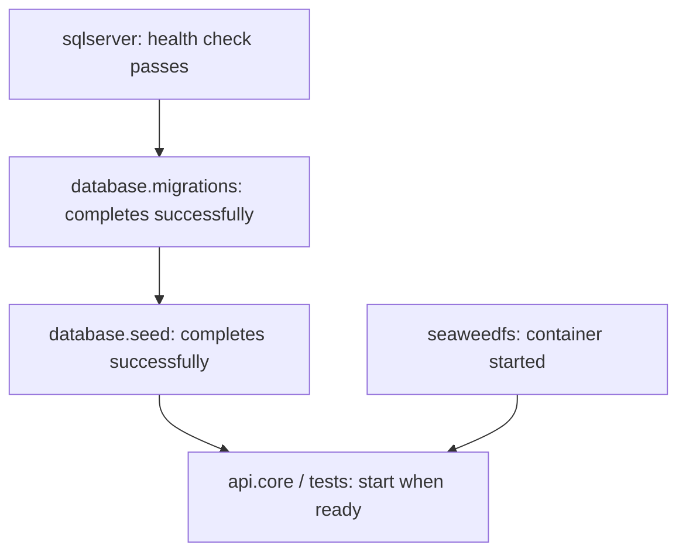

This document covers Docker deployment, configuration, and troubleshooting for
The Biergarten App.

## Overview

The project uses Docker Compose to orchestrate multiple services:

- SQL Server 2022 database
- Database migrations runner (DbUp)
- Database seeder
- .NET API
- React Router website (SSR frontend)
- Test runners

See the [deployment diagram](diagrams/deployment.md) for visual representation.

## Docker Compose environments

### 1. Development (`docker-compose.dev.yaml`)

**Purpose**: Local development with persistent data

**Features**:

- Persistent SQL Server volume
- NuGet package cache volume (speeds up rebuilds)
- Swagger UI enabled
- Seed data included
- Local Mailpit SMTP server for dev email testing
- Local SeaweedFS S3-compatible object storage for photo uploads
- `CLEAR_DATABASE=true` (drops and recreates schema)

**Services**:

```yaml
sqlserver           # SQL Server 2022 (port 1434)
database.migrations # DbUp migrations
database.seed      # Seed initial data
api.core           # Web API (ports 8080, 8081)
frontend           # React Router website (port 3000)
mailpit            # Local dev SMTP server + UI (port 8025)
seaweedfs           # S3-compatible object storage (ports 8333, 8888, 9333, 23646)
```

**Start Development Environment**:

```bash
docker compose --env-file web/.env.dev -f web/docker-compose.dev.yaml up -d
```

**Access**:

- Website: http://localhost:3000
- API Swagger: http://localhost:8080/swagger
- Health Check: http://localhost:8080/health
- Mailpit UI: http://localhost:8025
- SQL Server: localhost:1434 (sa credentials from .env.dev)
- SeaweedFS S3 API: http://localhost:8333 (credentials from
  `SEAWEEDFS_ACCESS_KEY_ID`/`SEAWEEDFS_SECRET_ACCESS_KEY` in .env.dev)
- SeaweedFS Filer UI: http://localhost:8888
- SeaweedFS Master UI: http://localhost:9333

**Stop Environment**:

```bash
# Stop services (keep volumes)
docker compose --env-file web/.env.dev -f web/docker-compose.dev.yaml down

# Stop and remove volumes (fresh start)
docker compose --env-file web/.env.dev -f web/docker-compose.dev.yaml down -v
```

### 2. Testing (`docker-compose.test.yaml`)

**Purpose**: Automated CI/CD testing in an isolated environment

**Features**:

- Fresh database each run
- All test suites execute in parallel
- Test results exported to `./test-results/`
- Containers auto-exit after completion
- Fully isolated testnet network

**Services**:

```yaml
sqlserver           # Test database
database.migrations # Fresh schema
database.seed      # Test data
api.specs          # Reqnroll BDD tests
unit.tests         # All Features.*.Tests unit test projects
frontend.tests     # Storybook Vitest + Playwright suites (own Playwright image)
```

**Run Tests**:

```bash
# Run all tests
docker compose --env-file web/.env.test -f web/docker-compose.test.yaml up -d
docker compose --env-file web/.env.test -f web/docker-compose.test.yaml wait api.specs unit.tests frontend.tests

# View results
ls -la test-results/
cat test-results/api-specs/results.trx
cat test-results/Features.Users.Tests.trx

# Clean up
docker compose --env-file web/.env.test -f web/docker-compose.test.yaml down -v
```

`wait` blocks until `api.specs`, `unit.tests`, and `frontend.tests` have all
stopped, regardless of which one finishes first; `up --abort-on-container-exit`
isn't used here because the one-shot `database.migrations`/`database.seed` jobs
and `frontend.tests` (no database dependency) can exit before the other test
containers, which would end the run prematurely. See
[Testing](testing.md#running-tests-with-docker-recommended) for details.

### 3. Production (`docker-compose.prod.yaml`)

**Purpose**: Production-ready deployment

**Features**:

- Production logging levels
- No database clearing
- Optimized build configurations
- Health checks enabled
- Restart policies (unless-stopped)
- Security hardening
- Only `frontend` publishes a port to the host; `sqlserver` and `api.core` are
  reachable only from other containers on `prodnet`

**Services**:

```yaml
sqlserver          # Production SQL Server (internal only)
database.migrations # Schema updates only
api.core          # Production API (internal only, no published ports)
frontend          # Production website (port 3000, the only public binding)
```

**Deploy Production**:

```bash
docker compose --env-file web/.env.prod -f web/docker-compose.prod.yaml up -d
```

### 4. Database only (`docker-compose.db.yaml`)

**Purpose**: Run just the database for local backend development outside Docker
(for example, `dotnet run` against a containerized SQL Server)

**Services**:

```yaml
sqlserver           # SQL Server 2022 (port 1434)
database.migrations # DbUp migrations
database.seed      # Seed initial data
```

No `api.core` or `mailpit` container. Uses `.env.dev`, same as development.

**Start**:

```bash
docker compose --env-file web/.env.dev -f web/docker-compose.db.yaml up -d
```

### 5. Minimal (`docker-compose.min.yaml`)

**Purpose**: Local dev where the API runs outside Docker but the database and
mail capture still run in containers

**Services**:

```yaml
sqlserver           # SQL Server 2022 (port 1433)
database.migrations # DbUp migrations
database.seed      # Seed initial data
mailpit            # Local dev SMTP server + UI (port 8025)
```

No `api.core` container. Uses `.env.local` instead of `.env.dev`, and exposes
SQL Server on the standard port 1433 (`docker-compose.db.yaml` and
`docker-compose.dev.yaml` both use 1434).

**Start**:

```bash
docker compose --env-file web/.env.local -f web/docker-compose.min.yaml up -d
```

## Service dependencies

Docker Compose manages startup order using health checks:



In development, `api.core` also depends on `seaweedfs`
(`condition: service_started`, not a health check) alongside `database.seed`.

**Health Check Example** (SQL Server):

```yaml
healthcheck:
  test:
    [
      "CMD-SHELL",
      "sqlcmd -S localhost -U sa -P '${DB_PASSWORD}' -C -Q 'SELECT 1'",
    ]
  interval: 10s
  timeout: 5s
  retries: 12
  start_period: 30s
```

**Dependency Configuration**:

```yaml
api.core:
  depends_on:
    database.seed:
      condition: service_completed_successfully
```

## Volumes

### Persistent volumes

**Development**:

- `sqlserverdata-dev` - Database files persist between restarts
- `nuget-cache-dev` - NuGet package cache (speeds up builds)
- `seaweedfsdata-dev` - SeaweedFS object storage data persists between restarts

**Testing**:

- `sqlserverdata-test` - Temporary, typically removed after tests

**Production**:

- `sqlserverdata-prod` - Production database files
- `nuget-cache-prod` - Production NuGet cache

### Mounted volumes

**Test Results**:

```yaml
volumes:
  - ./test-results:/app/test-results
```

Test results are written to host filesystem for CI/CD integration.

## Networks

Each environment uses isolated bridge networks:

- `devnet` - Development network
- `testnet` - Testing network (fully isolated)
- `prodnet` - Production network

## Environment variables

All containers are configured via environment variables from `.env` files:

```yaml
env_file: ".env.dev" # or .env.test, .env.prod

environment:
  ASPNETCORE_ENVIRONMENT: "Development"
  DOTNET_RUNNING_IN_CONTAINER: "true"
  DB_SERVER: "${DB_SERVER}"
  DB_NAME: "${DB_NAME}"
  DB_USER: "${DB_USER}"
  DB_PASSWORD: "${DB_PASSWORD}"
  ACCESS_TOKEN_SECRET: "${ACCESS_TOKEN_SECRET}"
  REFRESH_TOKEN_SECRET: "${REFRESH_TOKEN_SECRET}"
  CONFIRMATION_TOKEN_SECRET: "${CONFIRMATION_TOKEN_SECRET}"
  SEAWEEDFS_SERVICE_URL: "${SEAWEEDFS_SERVICE_URL}"
  SEAWEEDFS_ACCESS_KEY_ID: "${SEAWEEDFS_ACCESS_KEY_ID}"
  SEAWEEDFS_SECRET_ACCESS_KEY: "${SEAWEEDFS_SECRET_ACCESS_KEY}"
  SEAWEEDFS_BUCKET: "${SEAWEEDFS_BUCKET}"
```

For complete list, see [Environment Variables](environment-variables.md).

## Common commands

### View services

```bash
# Running services
docker compose --env-file web/.env.dev -f web/docker-compose.dev.yaml ps

# All containers (including stopped)
docker ps -a
```

### View logs

```bash
# All services
docker compose --env-file web/.env.dev -f web/docker-compose.dev.yaml logs -f

# Specific service
docker compose --env-file web/.env.dev -f web/docker-compose.dev.yaml logs -f api.core

# Last 100 lines
docker compose --env-file web/.env.dev -f web/docker-compose.dev.yaml logs --tail=100 api.core
```

### Execute commands in container

```bash
# Interactive shell
docker exec -it dev-env-api-core bash

# Run command (replace <db-password> with the value of DB_PASSWORD from .env.dev)
docker exec dev-env-sqlserver /opt/mssql-tools18/bin/sqlcmd -S localhost -U sa -P '<db-password>' -C
```

### Restart services

```bash
# Restart all services
docker compose --env-file web/.env.dev -f web/docker-compose.dev.yaml restart

# Restart specific service
docker compose --env-file web/.env.dev -f web/docker-compose.dev.yaml restart api.core

# Rebuild and restart
docker compose --env-file web/.env.dev -f web/docker-compose.dev.yaml up -d --build api.core
```

### Build images

```bash
# Build all images
docker compose --env-file web/.env.dev -f web/docker-compose.dev.yaml build

# Build specific service
docker compose --env-file web/.env.dev -f web/docker-compose.dev.yaml build api.core

# Build without cache
docker compose --env-file web/.env.dev -f web/docker-compose.dev.yaml build --no-cache
```

### Clean up

```bash
# Stop and remove containers
docker compose --env-file web/.env.dev -f web/docker-compose.dev.yaml down

# Remove containers and volumes
docker compose --env-file web/.env.dev -f web/docker-compose.dev.yaml down -v

# Remove containers, volumes, and images
docker compose --env-file web/.env.dev -f web/docker-compose.dev.yaml down -v --rmi all

# System-wide cleanup
docker system prune -af --volumes
```

## Dockerfile structure

### Multi-stage build

```dockerfile
# Stage 1: Build
FROM mcr.microsoft.com/dotnet/sdk:10.0 AS build
WORKDIR /src
COPY ["Project/Project.csproj", "Project/"]
RUN dotnet restore
COPY . .
RUN dotnet build -c Release

# Stage 2: Runtime
FROM mcr.microsoft.com/dotnet/aspnet:10.0 AS final
WORKDIR /app
COPY --from=build /app/build .
ENTRYPOINT ["dotnet", "Project.dll"]
```

## Additional resources

- [Docker Compose Documentation](https://docs.docker.com/compose/)
- [.NET Docker Images](https://hub.docker.com/_/microsoft-dotnet)
- [SQL Server Docker Images](https://hub.docker.com/_/microsoft-mssql-server)
