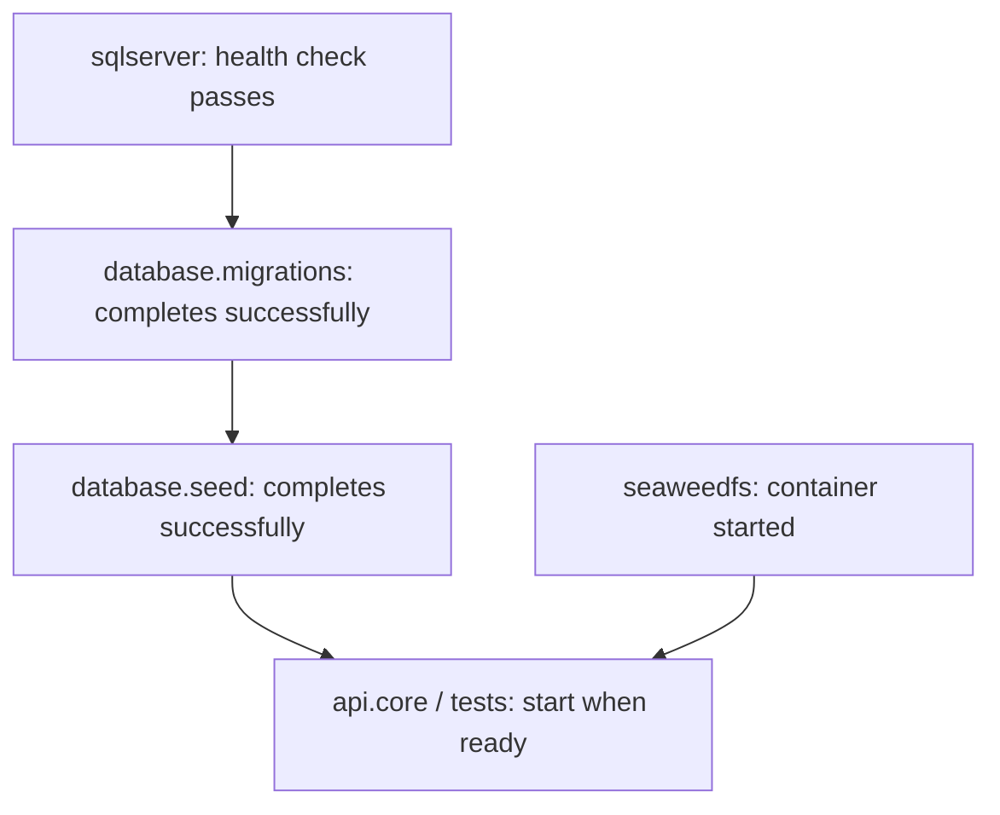

This document covers Docker deployment, configuration, and troubleshooting for
The Biergarten App.

## Overview

The project uses Docker Compose to orchestrate multiple services:

- SQL Server 2022 database
- Database migrations runner (DbUp)
- Database seeder
- .NET API
- React Router website (SSR frontend)
- Test runners

See the [deployment diagram](diagrams/deployment.md) for visual representation.

## Docker Compose environments

### 1. Development (`docker-compose.dev.yaml`)

**Purpose**: Local development with persistent data

**Features**:

- Persistent SQL Server volume
- NuGet package cache volume (speeds up rebuilds)
- Swagger UI enabled
- Seed data included
- Local Mailpit SMTP server for dev email testing
- Local SeaweedFS S3-compatible object storage for photo uploads
- `CLEAR_DATABASE=true` (drops and recreates schema)

**Services**:

```yaml
sqlserver           # SQL Server 2022 (port 1434)
database.migrations # DbUp migrations
database.seed      # Seed initial data
api.core           # Web API (ports 8080, 8081)
frontend           # React Router website (port 3000)
mailpit            # Local dev SMTP server + UI (port 8025)
seaweedfs           # S3-compatible object storage (ports 8333, 8888, 9333, 23646)
```

**Start Development Environment**:

```bash
docker compose --env-file web/.env.dev -f web/docker-compose.dev.yaml up -d
```

**Access**:

- Website: http://localhost:3000
- API Swagger: http://localhost:8080/swagger
- Health Check: http://localhost:8080/health
- Mailpit UI: http://localhost:8025
- SQL Server: localhost:1434 (sa credentials from .env.dev)
- SeaweedFS S3 API: http://localhost:8333 (credentials from
  `SEAWEEDFS_ACCESS_KEY_ID`/`SEAWEEDFS_SECRET_ACCESS_KEY` in .env.dev)
- SeaweedFS Filer UI: http://localhost:8888
- SeaweedFS Master UI: http://localhost:9333

**Stop Environment**:

```bash
# Stop services (keep volumes)
docker compose --env-file web/.env.dev -f web/docker-compose.dev.yaml down

# Stop and remove volumes (fresh start)
docker compose --env-file web/.env.dev -f web/docker-compose.dev.yaml down -v
```

### 2. Testing (`docker-compose.test.yaml`)

**Purpose**: Automated CI/CD testing in an isolated environment

**Features**:

- Fresh database each run
- All test suites execute in parallel
- Test results exported to `./test-results/`
- Containers auto-exit after completion
- Fully isolated testnet network

**Services**:

```yaml
sqlserver           # Test database
database.migrations # Fresh schema
database.seed      # Test data
api.specs          # Reqnroll BDD tests
unit.tests         # All Features.*.Tests and Shared.*.Tests unit test projects
frontend.tests     # Storybook Vitest + Playwright suites (own Playwright image)
```

**Run Tests**:

```bash
# Run all tests
docker compose --env-file web/.env.test -f web/docker-compose.test.yaml up -d
docker compose --env-file web/.env.test -f web/docker-compose.test.yaml wait api.specs unit.tests frontend.tests

# View results
ls -la test-results/
cat test-results/api-specs/results.trx
cat test-results/Features.Users.Tests.trx

# Clean up
docker compose --env-file web/.env.test -f web/docker-compose.test.yaml down -v
```

`wait` blocks until `api.specs`, `unit.tests`, and `frontend.tests` have all
stopped, regardless of which one finishes first; `up --abort-on-container-exit`
isn't used here because the one-shot `database.migrations`/`database.seed` jobs
and `frontend.tests` (no database dependency) can exit before the other test
containers, which would end the run prematurely. See
[Testing](testing.md#running-tests-with-docker-recommended) for details.

### 3. Production (`docker-compose.prod.yaml`)

**Purpose**: Production-ready deployment

**Features**:

- Production logging levels
- No database clearing
- Optimized build configurations
- Health checks on every long-running service
- Restart policies that survive a reboot (see
  [Restart tolerance](#restart-tolerance))
- Security hardening
- Only `frontend` publishes a port to the host, bound to `127.0.0.1` so a reverse
  proxy can sit in front of it; `sqlserver`, `api.core` and `seaweedfs` are
  reachable only from other containers on `prodnet` (named `biergarten-prodnet`
  so the seed job can join it from its own Compose project)
- Seeding is a separate, explicitly run compose file
  (`docker-compose.prod.seed.yaml`), so an `up` or a restart leaves the existing
  catalogue as it is. See [Production data](#production-data) below.

**Services**:

```yaml
sqlserver         # Production SQL Server (internal only)
api.core          # Production API (internal only, no published ports)
seaweedfs         # S3-compatible object storage (internal only)
frontend          # Production website (127.0.0.1:5656, the only host binding)
```

Migrating and seeding are run-once jobs kept outside this file, so an `up` or a
restart touches neither the schema nor the catalogue. Run them explicitly at
deploy time: see [Migrating production](#migrating-production) and
[Seeding production](#seeding-production-docker-composeprodseedyaml).

**Deploy Production**:

```bash
# One time, before the first `up`: the data volumes are external, so Compose
# expects them to exist already.
docker volume create biergartendata-prod
docker volume create seaweedfsdata-prod

docker compose --env-file web/.env.prod -f web/docker-compose.prod.yaml up -d
```

Docker seeds each volume with the ownership the image expects and labels it for
SELinux, so the host needs no `chown` and no `:z`/`:Z` mount options on
enforcing distributions such as RHEL, AlmaLinux and Fedora.

#### Migrating production

`database.migrations` is a run-once job rather than a service in the prod stack,
so the schema is migrated when an operator asks for it instead of on every boot.
Build the image and run it against the network the prod stack creates:

```bash
docker build -t database.migrations \
  -f web/backend/Database/Database.Migrations/Dockerfile \
  --build-arg BUILD_CONFIGURATION=Release --build-arg APP_UID=1000 \
  web/backend

docker run --rm --env-file web/.env.prod --network biergarten-prodnet \
  -e DOTNET_RUNNING_IN_CONTAINER=true database.migrations
```

DbUp records every script it has applied, so a re-run applies only what is new.
Run this with `sqlserver` already up and healthy, and before the seed job.

#### Restart tolerance

`sqlserver`, `api.core`, `seaweedfs` and `frontend` run under
`restart: unless-stopped`, so the stack returns on its own after a container
crash, a Docker daemon restart or a host reboot, provided Docker itself starts at
boot (`systemctl enable docker`). The migration and seed jobs stay out of the
stack, so a reboot replays neither.

The daemon replays restart policies without replaying the `depends_on` graph, so
after a reboot the containers come back in arbitrary order and each one tolerates
a dependency that arrives late. `api.core` opens its database and S3 connections
per request rather than at startup, and `frontend` answers with its own error
states while `api.core` is still coming up.

Health checks report when the stack has converged:

| Service | Probe |
| --- | --- |
| `sqlserver` | `sqlcmd -Q 'SELECT 1'`, with a 30s start period and 12 retries |
| `api.core` | `GET /health` spoken over bash's `/dev/tcp` — the .NET runtime image carries bash and no HTTP client |
| `seaweedfs` | `curl http://localhost:8333/status`, the S3 gateway, which serves once the master, volume and filer servers are up |
| `frontend` | `wget --spider http://127.0.0.1:5656/healthz`, answered by Express alone and so independent of the API |

`sqlserver` also carries `stop_grace_period: 60s`, giving a checkpoint time to
finish on shutdown instead of being recovered on the next start.

Deploy and wait for the stack to report healthy, or check convergence after a
reboot:

```bash
docker compose --env-file web/.env.prod -f web/docker-compose.prod.yaml up -d --wait
docker compose --env-file web/.env.prod -f web/docker-compose.prod.yaml ps
```

#### Seeding production (`docker-compose.prod.seed.yaml`)

`database.seed` lives in its own compose file, run on demand once the prod stack
is up, `sqlserver` is healthy, and the schema is migrated:

```bash
docker compose --env-file web/.env.prod -f web/docker-compose.prod.seed.yaml \
  run --rm --build database.seed
```

The job runs as the `biergarten-prod-seed` Compose project and attaches to the
external `biergarten-prodnet` network, which the main prod stack creates, so it
reaches `sqlserver` and `seaweedfs` under the same hostnames the API uses. It
exits when seeding finishes; `--rm` removes the container. Bring the prod stack
up first, because the seed project has no visibility into the other project's
health checks, so a run started before SQL Server is accepting connections fails.

#### Production data

A production deployment seeded this way serves the AI-generated fixture data
produced by the pipeline. Per
[Pipeline ethics, bias, and known issues](../pipeline/ETHICS-AND-KNOWN-ISSUES.md),
anyone interacting with an application seeded from it has to be told upfront that
the content is AI-generated.

The website meets that obligation with `AiDisclosureDialog`
(`web/frontend/app/features/home/components/AiDisclosureDialog.tsx`), which
the root route renders on every full page load, whichever route the visitor lands
on. It is part of the server-rendered HTML rather than mounted after hydration, so
the disclosure is on screen with the first paint. Acknowledging it hides the
dialog for the remainder of that page load; a new load shows it again.

Keep the seed job and the dialog together: any deployment that runs
`docker-compose.prod.seed.yaml` needs the disclosure in place to satisfy the
ethics documentation.

### 4. Database only (`docker-compose.db.yaml`)

**Purpose**: Run just the database for local backend development outside Docker
(for example, `dotnet run` against a containerized SQL Server)

**Services**:

```yaml
sqlserver           # SQL Server 2022 (port 1434)
database.migrations # DbUp migrations
database.seed      # Seed initial data
```

No `api.core` or `mailpit` container. Uses `.env.dev`, same as development.

**Start**:

```bash
docker compose --env-file web/.env.dev -f web/docker-compose.db.yaml up -d
```

### 5. Minimal (`docker-compose.min.yaml`)

**Purpose**: Local dev where the API runs outside Docker but the database and
mail capture still run in containers

**Services**:

```yaml
sqlserver           # SQL Server 2022 (port 1433)
database.migrations # DbUp migrations
database.seed      # Seed initial data
mailpit            # Local dev SMTP server + UI (port 8025)
```

No `api.core` container. Uses `.env.local` instead of `.env.dev`, and exposes
SQL Server on the standard port 1433 (`docker-compose.db.yaml` and
`docker-compose.dev.yaml` both use 1434).

**Start**:

```bash
docker compose --env-file web/.env.local -f web/docker-compose.min.yaml up -d
```

## Service dependencies

Docker Compose manages startup order using health checks:


```mermaid
graph TD
    A[sqlserver: health check passes] --> B[database.migrations: completes successfully]
    B --> C[database.seed: completes successfully]
    C --> D[api.core / tests: start when ready]
    E[seaweedfs: container started] --> D
```

In development, `api.core` also depends on `seaweedfs`
(`condition: service_started`, not a health check) alongside `database.seed`.

Production has a shorter chain, because the migration and seed jobs run outside
the stack: `api.core` waits for `seaweedfs` to pass its health check, and
`frontend` waits for `api.core` to report healthy. This ordering applies to
`docker compose up`; see [Restart tolerance](#restart-tolerance) for what happens
on a host reboot.

**Health Check Example** (SQL Server):

```yaml
healthcheck:
  test:
    [
      "CMD-SHELL",
      "sqlcmd -S localhost -U sa -P '${DB_PASSWORD}' -C -Q 'SELECT 1'",
    ]
  interval: 10s
  timeout: 5s
  retries: 12
  start_period: 30s
```

**Dependency Configuration**:

```yaml
api.core:
  depends_on:
    database.seed:
      condition: service_completed_successfully
```

## Volumes

### Persistent volumes

**Development**:

- `sqlserverdata-dev` - Database files persist between restarts
- `nuget-cache-dev` - NuGet package cache (speeds up builds)
- `seaweedfsdata-dev` - SeaweedFS object storage data persists between restarts

**Testing**:

- `sqlserverdata-test` - Temporary, typically removed after tests

**Production**:

- `biergartendata-prod` - Database files, external; survives `down -v`
- `seaweedfsdata-prod` - SeaweedFS object storage, external; survives `down -v`

See [Production data volumes](#production-data-volumes).

### Mounted volumes

**Test Results**:

```yaml
volumes:
  - ./test-results:/app/test-results
```

Test results are written to host filesystem for CI/CD integration.

### Production data volumes

`biergartendata-prod` and `seaweedfsdata-prod` are declared `external: true`.
Compose removes only the volumes it owns, so `docker compose down -v` tears the
stack down and leaves the database and the uploaded photos in place. Deleting
them takes an explicit `docker volume rm`.

The trade-off is that Compose creates neither one, and `up` fails with a clear
error until both exist, hence the `docker volume create` step in
[Deploy Production](#3-production-docker-composeprodyaml). External volumes also
carry their literal name rather than a `<project>_` prefix, so `docker volume ls`
shows `biergartendata-prod` and `seaweedfsdata-prod` unprefixed, unlike the
`web_`-prefixed volumes of the dev and test stacks.

Both live under `/var/lib/docker/volumes`. To put them on a specific disk, point
the daemon's `data-root` at it in `/etc/docker/daemon.json`, or mount the disk at
`/var/lib/docker`.

Back up the database through SQL Server rather than by copying its files, since a
file copy taken while the engine is running can be torn:

```bash
docker exec prod-env-sqlserver /opt/mssql-tools18/bin/sqlcmd \
  -S localhost -U sa -P '<db-password>' -C \
  -Q "BACKUP DATABASE [<db-name>] TO DISK = '/var/opt/mssql/data/backup.bak'"
docker cp prod-env-sqlserver:/var/opt/mssql/data/backup.bak .
```

Object storage can be archived directly, with the stack stopped:

```bash
docker run --rm -v seaweedfsdata-prod:/data -v "$PWD:/backup" \
  alpine tar czf /backup/seaweedfs.tar.gz -C /data .
```

## Networks

Each environment uses isolated bridge networks:

- `devnet` - Development network
- `testnet` - Testing network (fully isolated)
- `prodnet` - Production network

## Environment variables

All containers are configured via environment variables from `.env` files:

```yaml
env_file: ".env.dev" # or .env.test, .env.prod

environment:
  ASPNETCORE_ENVIRONMENT: "Development"
  DOTNET_RUNNING_IN_CONTAINER: "true"
  DB_SERVER: "${DB_SERVER}"
  DB_NAME: "${DB_NAME}"
  DB_USER: "${DB_USER}"
  DB_PASSWORD: "${DB_PASSWORD}"
  ACCESS_TOKEN_SECRET: "${ACCESS_TOKEN_SECRET}"
  REFRESH_TOKEN_SECRET: "${REFRESH_TOKEN_SECRET}"
  CONFIRMATION_TOKEN_SECRET: "${CONFIRMATION_TOKEN_SECRET}"
  SEAWEEDFS_SERVICE_URL: "${SEAWEEDFS_SERVICE_URL}"
  SEAWEEDFS_ACCESS_KEY_ID: "${SEAWEEDFS_ACCESS_KEY_ID}"
  SEAWEEDFS_SECRET_ACCESS_KEY: "${SEAWEEDFS_SECRET_ACCESS_KEY}"
  SEAWEEDFS_BUCKET: "${SEAWEEDFS_BUCKET}"
```

For complete list, see [Environment Variables](environment-variables.md).

## Common commands

### View services

```bash
# Running services
docker compose --env-file web/.env.dev -f web/docker-compose.dev.yaml ps

# All containers (including stopped)
docker ps -a
```

### View logs

```bash
# All services
docker compose --env-file web/.env.dev -f web/docker-compose.dev.yaml logs -f

# Specific service
docker compose --env-file web/.env.dev -f web/docker-compose.dev.yaml logs -f api.core

# Last 100 lines
docker compose --env-file web/.env.dev -f web/docker-compose.dev.yaml logs --tail=100 api.core
```

### Execute commands in container

```bash
# Interactive shell
docker exec -it dev-env-api-core bash

# Run command (replace <db-password> with the value of DB_PASSWORD from .env.dev)
docker exec dev-env-sqlserver /opt/mssql-tools18/bin/sqlcmd -S localhost -U sa -P '<db-password>' -C
```

### Restart services

```bash
# Restart all services
docker compose --env-file web/.env.dev -f web/docker-compose.dev.yaml restart

# Restart specific service
docker compose --env-file web/.env.dev -f web/docker-compose.dev.yaml restart api.core

# Rebuild and restart
docker compose --env-file web/.env.dev -f web/docker-compose.dev.yaml up -d --build api.core
```

### Build images

```bash
# Build all images
docker compose --env-file web/.env.dev -f web/docker-compose.dev.yaml build

# Build specific service
docker compose --env-file web/.env.dev -f web/docker-compose.dev.yaml build api.core

# Build without cache
docker compose --env-file web/.env.dev -f web/docker-compose.dev.yaml build --no-cache
```

### Clean up

```bash
# Stop and remove containers
docker compose --env-file web/.env.dev -f web/docker-compose.dev.yaml down

# Remove containers and volumes
docker compose --env-file web/.env.dev -f web/docker-compose.dev.yaml down -v

# Remove containers, volumes, and images
docker compose --env-file web/.env.dev -f web/docker-compose.dev.yaml down -v --rmi all

# System-wide cleanup
docker system prune -af --volumes
```

## Dockerfile structure

### Multi-stage build

```dockerfile
# Stage 1: Build
FROM mcr.microsoft.com/dotnet/sdk:10.0 AS build
WORKDIR /src
COPY ["Project/Project.csproj", "Project/"]
RUN dotnet restore
COPY . .
RUN dotnet build -c Release

# Stage 2: Runtime
FROM mcr.microsoft.com/dotnet/aspnet:10.0 AS final
WORKDIR /app
COPY --from=build /app/build .
ENTRYPOINT ["dotnet", "Project.dll"]
```

## Additional resources

- [Docker Compose Documentation](https://docs.docker.com/compose/)
- [.NET Docker Images](https://hub.docker.com/_/microsoft-dotnet)
- [SQL Server Docker Images](https://hub.docker.com/_/microsoft-mssql-server)
