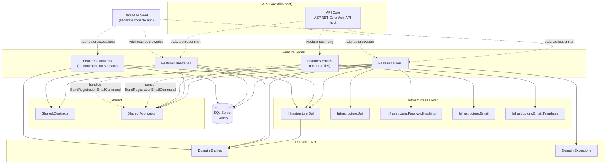

# The Biergarten App — Vertical Slice Architecture

## Notes

- **API.Core**: Program.cs wiring only — MediatR + `AddApplicationPart` per `Features.*` assembly, Swagger/OpenAPI, health checks, JWT auth middleware, global exception filter.
- **Feature slices**: each owns its own controller (HTTP endpoints), commands/queries + handlers, validators, and Dapper repository. `Features.Users` covers auth (`Commands/Authentication`), account management (`Commands/Account`), and profile/avatar (`Commands/Profile`). `Features.Emails` has no controller — invoked only via MediatR commands sent from other slices. `Features.Locations` has no controller and no MediatR handlers — it exposes `ILocationRepository` directly as a plain DI service, not registered by `API.Core` at all; only `Database.Seed` depends on it today.
- **Shared.Application**: `ValidationBehavior` (MediatR pipeline) plus the cross-slice email commands (`SendRegistrationEmailCommand`, `SendResendConfirmationEmailCommand`) — the one cross-slice interaction is a MediatR command contract, not a project reference.
- **Domain.Entities**: `UserAccount`, `UserCredential`, `UserVerification`, `UserProfile`, `UserAvatar`, `BreweryPost`, `BreweryPostLocation`, `City`, `StateProvince`, `Country`, `BeerPost`, `BeerStyle` (schema tables exist for the last two; no repository yet).
- **Infrastructure.Sql**: SQL-first approach — each slice's own repository issues inline SQL via Dapper, no ORM, no stored procedures.
- **Database.Seed**: calls each slice's `AddFeatures*()` DI extension directly — no API host, no MediatR pipeline.
- No `Features.*` project ever references another `Features.*` project directly.
