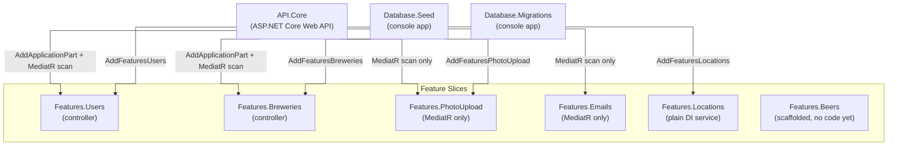
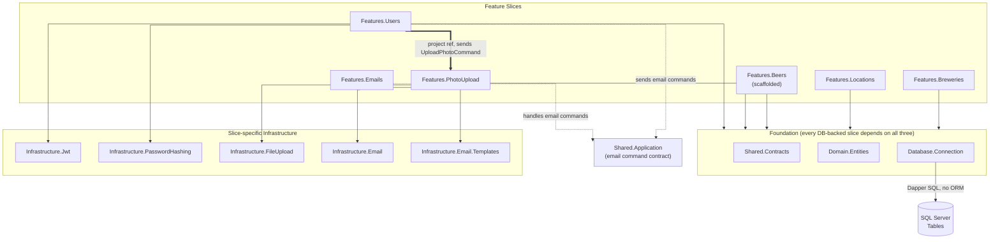

# The Biergarten App — Vertical Slice Architecture

Two diagrams, split by concern: which host wires up which slice at startup, and
which projects each slice actually compiles against. Mixing DI wiring and
compile-time references in one graph is what made the old diagram unreadable.

## Host wiring

Each host (`API.Core`, `Database.Seed`) decides for itself which `Features.*`
assemblies to register — there's no shared bootstrap. `Database.Migrations`
doesn't wire up any slice; it applies schema directly.

## Project reference dependencies

Solid arrows are compile-time project references. Dashed arrows are the two
places slices talk to each other without a direct reference: the email
MediatR contract routed through `Shared.Application`, and the one place that
pattern is broken outright. Every DB-backed slice depends on the same three
foundation projects (`Shared.Contracts`, `Domain.Entities`,
`Database.Connection`) — drawn as one box instead of fifteen separate arrows;
see the notes for what else each of those foundation projects pulls in.

## Notes

- **API.Core**: Program.cs wiring only — MediatR + `AddApplicationPart` per HTTP-exposed `Features.*` assembly, Swagger/OpenAPI, health checks, JWT auth middleware, global exception filter. Only `Features.Users` and `Features.Breweries` get `AddApplicationPart` (controllers); `Features.PhotoUpload` and `Features.Emails` are scanned for MediatR handlers only. `Features.Locations` and `Features.Beers` aren't referenced by `API.Core` at all.
- **Feature slices**: each owns its own controller (where present), commands/queries + handlers, validators, and Dapper repository. `Features.Users` covers auth (`Commands/Authentication`), account management (`Commands/Account`), and profile/avatar (`Commands/Profile`) — internally namespaced `Features.Auth`, despite the project being named `Features.Users`. `Features.Emails` and `Features.PhotoUpload` have no controller — invoked only via MediatR commands sent from other slices. `Features.Locations` has no controller either; it now has one MediatR handler (`GetOrCreateCityHandler`), but that's only registered by `Database.Seed`'s own MediatR pipeline — `API.Core` never scans it. `Features.Beers` is scaffolded (project + references only, no source files yet).
- **The one exception to slice isolation**: `Features.Users` takes a direct project reference to `Features.PhotoUpload` and sends its `UploadPhotoCommand` via MediatR from `UploadAvatarHandler` — unlike the email flow, the command type lives in the target slice itself, not in `Shared.Application`.
- **Shared.Application**: `ValidationBehavior` (MediatR pipeline) plus the cross-slice email commands (`SendRegistrationEmailCommand`, `SendResendConfirmationEmailCommand`) — that interaction is a MediatR command contract, not a project reference, and every slice (including `Features.Emails`) references it for the pipeline behavior alone.
- **Domain.Entities**: `UserAccount`, `UserCredential`, `UserVerification`, `UserProfile`, `UserAvatar`, `BreweryPost`, `BreweryPostLocation`, `City`, `StateProvince`, `Country`, `BeerPost`, `BeerStyle`, `Photo` (schema tables exist for `BeerPost`/`BeerStyle`; no repository yet since `Features.Beers` has no code).
- **Database.Connection**: the shared connection-factory project — each slice's own repository issues inline SQL via Dapper against it, no ORM, no stored procedures. Replaces the old `Infrastructure.Sql` project.
- **Database.Migrations**: separate console app (`schema.dbml` + SQL scripts) that applies DDL directly — distinct from `Database.Seed`, which loads data through the feature slices' own DI extensions.
- **Database.Seed**: calls each slice's `AddFeatures*()` DI extension directly and builds its own MediatR registration — no API host, no shared pipeline with `API.Core`.
- **Omitted from the diagram**: `Domain.Exceptions` (referenced by nearly every project directly, including all of `Shared.Contracts`, `Infrastructure.Jwt`, and each feature slice) and `Infrastructure.Configuration` (the shared options-binding project referenced by `Database.Connection`, `Infrastructure.Email`, `Infrastructure.FileUpload`, and `Features.Emails` directly) — both are plumbing-level dependencies of nearly everything above, and drawing them would just add a second copy of the same fan-in.
