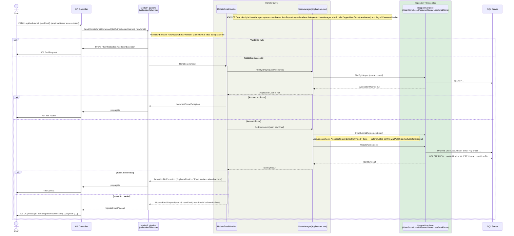

# User Authentication Flow — Update Email

```mermaid
sequenceDiagram
    actor User
    participant API as API Controller
    participant Mediator as MediatR pipeline<br/>(ValidationBehavior)
    box rgb(241,243,234) Handler Layer
        participant UpdateEmailHandler
        participant UserMgr as UserManager(ApplicationUser)
    end
    box rgb(219,238,221) Repository / Cross-slice
        participant UserStore as DapperUserStore<br/>(IUserStore/IUserPasswordStore/IUserEmailStore)
    end
    participant DB as SQL Server

    Note over UserMgr: ASP.NET Core Identity's UserManager replaces the deleted AuthRepository — handlers delegate to UserManager, which calls DapperUserStore (persistence) and Argon2PasswordHasher.

    User->>API: PATCH /api/auth/email {newEmail} (requires Bearer access token)
    activate API
    API->>Mediator: Send(UpdateEmailCommand(GetAuthenticatedUserId(), newEmail))
    activate Mediator
    Note right of Mediator: ValidationBehavior runs UpdateEmailValidator (same format rules as registration)

    alt Validation fails
        Mediator->>API: throws FluentValidation.ValidationException
        API->>User: 400 Bad Request
    else Validation succeeds
        Mediator->>UpdateEmailHandler: Handle(command)
        activate UpdateEmailHandler

        UpdateEmailHandler->>UserMgr: FindByIdAsync(userAccountId)
        activate UserMgr
        UserMgr->>UserStore: FindByIdAsync(userAccountId)
        UserStore->>DB: SELECT ...
        UserStore-->>UserMgr: ApplicationUser or null
        UserMgr-->>UpdateEmailHandler: ApplicationUser or null
        deactivate UserMgr

        alt Account not found
            UpdateEmailHandler->>Mediator: throw NotFoundException
            Mediator->>API: propagate
            API->>User: 404 Not Found
        else Account found
            UpdateEmailHandler->>UserMgr: SetEmailAsync(user, newEmail)
            activate UserMgr
            UserMgr->>UserStore: FindByEmailAsync(newEmail)
            Note right of UserMgr: Uniqueness check. Also resets user.EmailConfirmed = false — caller must re-confirm via POST /api/auth/confirm/resend
            UserMgr->>UserStore: UpdateAsync(user)
            UserStore->>DB: UPDATE UserAccount SET Email = @Email, ...
            UserStore->>DB: DELETE FROM UserVerification WHERE UserAccountID = @Id
            UserStore-->>UserMgr: IdentityResult
            UserMgr-->>UpdateEmailHandler: IdentityResult
            deactivate UserMgr

            alt !result.Succeeded
                UpdateEmailHandler->>Mediator: throw ConflictException (DuplicateEmail → "Email address already exists")
                Mediator->>API: propagate
                API->>User: 409 Conflict
            else result.Succeeded
                UpdateEmailHandler-->>Mediator: UpdateEmailPayload(user.Id, user.Email, user.EmailConfirmed = false)
                deactivate UpdateEmailHandler
                Mediator-->>API: UpdateEmailPayload
                deactivate Mediator
                API->>User: 200 OK {message: "Email updated successfully.", payload: {...}}
            end
        end
    end
    deactivate API
```
