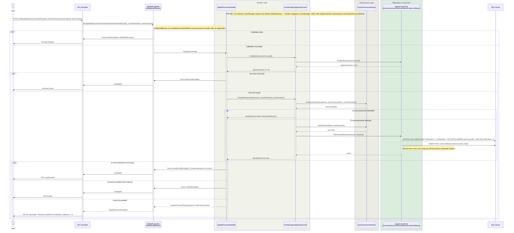

# User Authentication Flow — Update Password

```mermaid
sequenceDiagram
    actor User
    participant API as API Controller
    participant Mediator as MediatR pipeline<br/>(ValidationBehavior)
    box rgb(241,243,234) Handler Layer
        participant UpdatePasswordHandler
        participant UserMgr as UserManager(ApplicationUser)
    end
    box rgb(235,236,227) Infrastructure Layer
        participant Argon2 as Argon2PasswordHasher
    end
    box rgb(219,238,221) Repository / Cross-slice
        participant UserStore as DapperUserStore<br/>(IUserStore/IUserPasswordStore/IUserEmailStore)
    end
    participant DB as SQL Server

    Note over UserMgr: ASP.NET Core Identity's UserManager replaces the deleted AuthRepository — handlers delegate to UserManager, which calls DapperUserStore (persistence) and Argon2PasswordHasher.

    User->>API: PATCH /api/auth/password {currentPassword, newPassword} (requires Bearer access token)
    activate API
    API->>Mediator: Send(UpdatePasswordCommand(GetAuthenticatedUserId(), currentPassword, newPassword))
    activate Mediator
    Note right of Mediator: ValidationBehavior runs UpdatePasswordValidator (same password strength rules as registration)

    alt Validation fails
        Mediator->>API: throws FluentValidation.ValidationException
        API->>User: 400 Bad Request
    else Validation succeeds
        Mediator->>UpdatePasswordHandler: Handle(command)
        activate UpdatePasswordHandler

        UpdatePasswordHandler->>UserMgr: FindByIdAsync(userAccountId)
        activate UserMgr
        UserMgr->>UserStore: FindByIdAsync(userAccountId)
        UserStore-->>UserMgr: ApplicationUser or null
        UserMgr-->>UpdatePasswordHandler: ApplicationUser or null
        deactivate UserMgr

        alt Account not found
            UpdatePasswordHandler->>Mediator: throw NotFoundException
            Mediator->>API: propagate
            API->>User: 404 Not Found
        else Account found
            UpdatePasswordHandler->>UserMgr: ChangePasswordAsync(user, currentPassword, newPassword)
            activate UserMgr
            UserMgr->>Argon2: VerifyHashedPassword(user, user.PasswordHash, currentPassword)
            activate Argon2
            Argon2-->>UserMgr: Success/Failed
            deactivate Argon2

            alt Current password mismatch
                UserMgr-->>UpdatePasswordHandler: IdentityResult.Failed (PasswordMismatch)
            else Current password matches
                UserMgr->>Argon2: HashPassword(user, newPassword)
                activate Argon2
                Argon2-->>UserMgr: new hash
                deactivate Argon2
                UserMgr->>UserStore: SetPasswordHashAsync(user, newHash)
                activate UserStore
                UserStore->>DB: UPDATE UserCredential SET IsRevoked = 1, RevokedAt = GETDATE() WHERE UserAccountId = @Id AND IsRevoked = 0
                UserStore->>DB: INSERT INTO UserCredential (UserAccountId, Hash)
                Note right of UserStore: Revoke-then-insert runs inside one DbTransaction (credential rotation)
                UserStore-->>UserMgr: (void)
                deactivate UserStore
                UserMgr-->>UpdatePasswordHandler: IdentityResult.Success
            end
            deactivate UserMgr

            alt Current password is incorrect
                UpdatePasswordHandler->>Mediator: throw UnauthorizedException "Current password is incorrect"
                Mediator->>API: propagate
                API->>User: 401 Unauthorized
            else !result.Succeeded (other failure)
                UpdatePasswordHandler->>Mediator: throw ConflictException
                Mediator->>API: propagate
                API->>User: 409 Conflict
            else result.Succeeded
                UpdatePasswordHandler-->>Mediator: UpdatePasswordPayload(user.Id, DateTime.UtcNow)
                deactivate UpdatePasswordHandler
                Mediator-->>API: UpdatePasswordPayload
                deactivate Mediator
                API->>User: 200 OK {message: "Password updated successfully.", payload: {...}}
            end
        end
    end
    deactivate API
```
