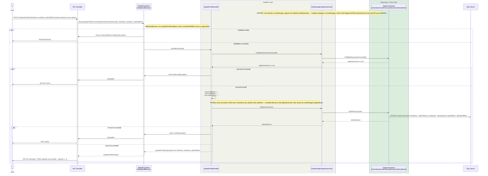

# User Authentication Flow — Update Profile

```mermaid
sequenceDiagram
    actor User
    participant API as API Controller
    participant Mediator as MediatR pipeline<br/>(ValidationBehavior)
    box rgb(241,243,234) Handler Layer
        participant UpdateProfileHandler
        participant UserMgr as UserManager(ApplicationUser)
    end
    box rgb(219,238,221) Repository / Cross-slice
        participant UserStore as DapperUserStore<br/>(IUserStore/IUserPasswordStore/IUserEmailStore)
    end
    participant DB as SQL Server

    Note over UserMgr: ASP.NET Core Identity's UserManager replaces the deleted AuthRepository — handlers delegate to UserManager, which calls DapperUserStore (persistence) and Argon2PasswordHasher.

    User->>API: PATCH /api/auth/profile {firstName, lastName, dateOfBirth} (requires Bearer access token)
    activate API
    API->>Mediator: Send(UpdateProfileCommand(GetAuthenticatedUserId(), firstName, lastName, dateOfBirth))
    activate Mediator
    Note right of Mediator: ValidationBehavior runs UpdateProfileValidator (same name/DateOfBirth rules as registration)

    alt Validation fails
        Mediator->>API: throws FluentValidation.ValidationException
        API->>User: 400 Bad Request
    else Validation succeeds
        Mediator->>UpdateProfileHandler: Handle(command)
        activate UpdateProfileHandler

        UpdateProfileHandler->>UserMgr: FindByIdAsync(userAccountId)
        activate UserMgr
        UserMgr->>UserStore: FindByIdAsync(userAccountId)
        UserStore-->>UserMgr: ApplicationUser or null
        UserMgr-->>UpdateProfileHandler: ApplicationUser or null
        deactivate UserMgr

        alt Account not found
            UpdateProfileHandler->>Mediator: throw NotFoundException
            Mediator->>API: propagate
            API->>User: 404 Not Found
        else Account found
            UpdateProfileHandler->>UpdateProfileHandler: user.FirstName = ...<br/>user.LastName = ...<br/>user.DateOfBirth = ...
            Note right of UpdateProfileHandler: First/last name and date of birth aren't tracked by any Identity store interface — mutated directly on the ApplicationUser, then saved via UserManager.UpdateAsync

            UpdateProfileHandler->>UserMgr: UpdateAsync(user)
            activate UserMgr
            UserMgr->>UserStore: UpdateAsync(user)
            UserStore->>DB: UPDATE UserAccount SET FirstName = @FirstName, LastName = @LastName, DateOfBirth = @DateOfBirth, ...
            UserStore-->>UserMgr: IdentityResult
            UserMgr-->>UpdateProfileHandler: IdentityResult
            deactivate UserMgr

            alt !result.Succeeded
                UpdateProfileHandler->>Mediator: throw ConflictException
                Mediator->>API: propagate
                API->>User: 409 Conflict
            else result.Succeeded
                UpdateProfileHandler-->>Mediator: UpdateProfilePayload(user.Id, firstName, lastName, dateOfBirth)
                deactivate UpdateProfileHandler
                Mediator-->>API: UpdateProfilePayload
                deactivate Mediator
                API->>User: 200 OK {message: "Profile updated successfully.", payload: {...}}
            end
        end
    end
    deactivate API
```
