# Biergarten Pipeline

A high-performance C++23 data pipeline for fetching, parsing, and storing geographic data (countries, states, cities) with brewery metadata generation capabilities. The system supports both mock and LLM-based (llama.cpp) generation modes.

## Overview

The pipeline orchestrates **four key stages**:

1. **Download** - Fetches `countries+states+cities.json` from a pinned GitHub commit with optional local filesystem caching
2. **Parse** - Streams JSON using Boost.JSON's `basic_parser` to extract country/state/city records without loading the entire file into memory
3. **Store** - Inserts records into a file-based SQLite database with all operations performed sequentially in a single thread
4. **Generate** - Produces brewery metadata or user profiles (mock implementation; supports future LLM integration via llama.cpp)

## System Architecture

### Data Sources and Formats

- **Hierarchical Structure**: Countries array → states per country → cities per state
- **Data Fields**:
  - `id` (integer)
  - `name` (string)
  - `iso2` / `iso3` (ISO country/state codes)
  - `latitude` / `longitude` (geographic coordinates)
- **Source**: [dr5hn/countries-states-cities-database](https://github.com/dr5hn/countries-states-cities-database) on GitHub
- **Output**: Structured SQLite file-based database (`biergarten-pipeline.db`) + structured logging via spdlog

### Concurrency Model

The pipeline currently operates **single-threaded** with sequential stage execution:

1. **Download Phase**: Main thread blocks while downloading the source JSON file (if not in cache)
2. **Parse & Store Phase**: Main thread performs streaming JSON parse with immediate SQLite inserts

**Thread Safety**: While single-threaded, the `SqliteDatabase` component is **mutex-protected** using `std::mutex` (`dbMutex`) for all database operations. This design enables safe future parallelization without code modifications.

## Core Components

| Component                     | Purpose                                                                                         | Thread Safety                                | Dependencies                                  |
| ----------------------------- | ----------------------------------------------------------------------------------------------- | -------------------------------------------- | --------------------------------------------- |
| **BiergartenDataGenerator**   | Orchestrates pipeline execution; manages lifecycle of downloader, parser, and generator         | Single-threaded coordinator                  | ApplicationOptions, WebClient, SqliteDatabase |
| **DataDownloader**            | HTTP fetch with curl; optional filesystem cache; ETag support and retries                       | Blocking I/O; safe for startup               | IWebClient, filesystem                        |
| **StreamingJsonParser**       | Extends `boost::json::basic_parser`; emits country/state/city via callbacks; tracks parse depth | Single-threaded parse; callbacks thread-safe | Boost.JSON                                    |
| **JsonLoader**                | Wraps parser; dispatches callbacks for country/state/city; manages WorkQueue lifecycle          | Produces to WorkQueue; safe callbacks        | StreamingJsonParser, SqliteDatabase           |
| **SqliteDatabase**            | Manages schema initialization; insert/query methods for geographic data                         | Mutex-guarded all operations                 | SQLite3                                       |
| **IDataGenerator** (Abstract) | Interface for brewery/user metadata generation                                                  | Stateless virtual methods                    | N/A                                           |
| **LlamaGenerator**            | LLM-based generation via llama.cpp; configurable sampling (temperature, top-p, seed)            | Manages llama_model* and llama_context*      | llama.cpp, BreweryResult, UserResult          |
| **MockGenerator**             | Deterministic mock generation using seeded randomization                                        | Stateless; thread-safe                       | N/A                                           |
| **CURLWebClient**             | HTTP client adapter; URL encoding; file downloads                                               | cURL library bindings                        | libcurl                                       |
| **WikipediaService**          | (Planned) Wikipedia data lookups for enrichment                                                 | N/A                                          | IWebClient                                    |

## Database Schema

SQLite file-based database with **three core tables** and **indexes for fast lookups**:

### Countries

```sql
CREATE TABLE countries (
  id INTEGER PRIMARY KEY,
  name TEXT NOT NULL,
  iso2 TEXT,
  iso3 TEXT
);
CREATE INDEX idx_countries_iso2 ON countries(iso2);
```

### States

```sql
CREATE TABLE states (
  id INTEGER PRIMARY KEY,
  country_id INTEGER NOT NULL,
  name TEXT NOT NULL,
  iso2 TEXT,
  FOREIGN KEY (country_id) REFERENCES countries(id)
);
CREATE INDEX idx_states_country ON states(country_id);
```

### Cities

```sql
CREATE TABLE cities (
  id INTEGER PRIMARY KEY,
  state_id INTEGER NOT NULL,
  country_id INTEGER NOT NULL,
  name TEXT NOT NULL,
  latitude REAL,
  longitude REAL,
  FOREIGN KEY (state_id) REFERENCES states(id),
  FOREIGN KEY (country_id) REFERENCES countries(id)
);
CREATE INDEX idx_cities_state ON cities(state_id);
CREATE INDEX idx_cities_country ON cities(country_id);
```

## Architecture Diagram

```plantuml
@startuml biergarten-pipeline
!theme plain
skinparam monochrome true
skinparam classBackgroundColor #FFFFFF
skinparam classBorderColor #000000

package "Application Layer" {
  class BiergartenDataGenerator {
    - options: ApplicationOptions
    - webClient: IWebClient
    - database: SqliteDatabase
    - generator: IDataGenerator
    --
    + Run() : int
  }
}

package "Data Acquisition" {
  class DataDownloader {
    - webClient: IWebClient
    --
    + Download(url: string, filePath: string)
    + DownloadWithCache(url: string, cachePath: string)
  }

  interface IWebClient {
    + DownloadToFile(url: string, filePath: string)
    + Get(url: string) : string
    + UrlEncode(value: string) : string
  }

  class CURLWebClient {
    - globalState: CurlGlobalState
    --
    + DownloadToFile(url: string, filePath: string)
    + Get(url: string) : string
    + UrlEncode(value: string) : string
  }
}

package "JSON Processing" {
  class StreamingJsonParser {
    - depth: int
    --
    + on_object_begin()
    + on_object_end()
    + on_array_begin()
    + on_array_end()
    + on_key(str: string)
    + on_string(str: string)
    + on_number(value: int)
  }

  class JsonLoader {
    --
    + LoadWorldCities(jsonPath: string, db: SqliteDatabase)
  }
}

package "Data Storage" {
  class SqliteDatabase {
    - db: sqlite3*
    - dbMutex: std::mutex
    --
    + Initialize(dbPath: string)
    + InsertCountry(id: int, name: string, iso2: string, iso3: string)
    + InsertState(id: int, countryId: int, name: string, iso2: string)
    + InsertCity(id: int, stateId: int, countryId: int, name: string, lat: double, lon: double)
    + QueryCountries(limit: int) : vector<Country>
    + QueryStates(limit: int) : vector<State>
    + QueryCities() : vector<City>
    + BeginTransaction()
    + CommitTransaction()
    # InitializeSchema()
  }

  struct Country {
    id: int
    name: string
    iso2: string
    iso3: string
  }

  struct State {
    id: int
    name: string
    iso2: string
    countryId: int
  }

  struct City {
    id: int
    name: string
    countryId: int
  }
}

package "Data Generation" {
  interface IDataGenerator {
    + load(modelPath: string)
    + generateBrewery(cityName: string, countryName: string, regionContext: string) : BreweryResult
    + generateUser(locale: string) : UserResult
  }

  class LlamaGenerator {
    - model: llama_model*
    - context: llama_context*
    - sampling_temperature: float
    - sampling_top_p: float
    - sampling_seed: uint32_t
    --
    + load(modelPath: string)
    + generateBrewery(...) : BreweryResult
    + generateUser(locale: string) : UserResult
    + setSamplingOptions(temperature: float, topP: float, seed: int)
    # infer(prompt: string) : string
  }

  class MockGenerator {
    --
    + load(modelPath: string)
    + generateBrewery(...) : BreweryResult
    + generateUser(locale: string) : UserResult
  }

  struct BreweryResult {
    name: string
    description: string
  }

  struct UserResult {
    username: string
    bio: string
  }
}

package "Enrichment (Planned)" {
  class WikipediaService {
    - webClient: IWebClient
    --
    + SearchCity(cityName: string, countryName: string) : string
  }
}

' Relationships
BiergartenDataGenerator --> DataDownloader
BiergartenDataGenerator --> JsonLoader
BiergartenDataGenerator --> SqliteDatabase
BiergartenDataGenerator --> IDataGenerator

DataDownloader --> IWebClient
CURLWebClient ..|> IWebClient

JsonLoader --> StreamingJsonParser
JsonLoader --> SqliteDatabase

LlamaGenerator ..|> IDataGenerator
MockGenerator ..|> IDataGenerator

SqliteDatabase --> Country
SqliteDatabase --> State
SqliteDatabase --> City

LlamaGenerator --> BreweryResult
LlamaGenerator --> UserResult
MockGenerator --> BreweryResult
MockGenerator --> UserResult

WikipediaService --> IWebClient

@enduml
```



## Configuration and Extensibility

### Command-Line Arguments

Boost.Program_options provides named CLI arguments. Running without arguments displays usage instructions.

```bash
./biergarten-pipeline [options]
```

**Requirement**: Exactly one of `--mocked` or `--model` must be specified.

| Argument        | Short | Type   | Purpose                                                         |
| --------------- | ----- | ------ | --------------------------------------------------------------- |
| `--mocked`      | -     | flag   | Use mocked generator for brewery/user data                      |
| `--model`       | `-m`  | string | Path to LLM model file (gguf); mutually exclusive with --mocked |
| `--cache-dir`   | `-c`  | path   | Directory for cached JSON (default: `/tmp`)                     |
| `--temperature` | -     | float  | LLM sampling temperature 0.0-1.0 (default: `0.8`)               |
| `--top-p`       | -     | float  | Nucleus sampling parameter 0.0-1.0 (default: `0.92`)            |
| `--seed`        | -     | int    | Random seed: -1 for random (default: `-1`)                      |
| `--help`        | `-h`  | flag   | Show help message                                               |

**Note**: The data source is always pinned to commit `c5eb7772` (stable 2026-03-28) and cannot be changed.

**Note**: When `--mocked` is used, any sampling parameters (`--temperature`, `--top-p`, `--seed`) are ignored with a warning.

### Usage Examples

```bash
# Mocked generator (deterministic, no LLM required)
./biergarten-pipeline --mocked

# With LLM model
./biergarten-pipeline --model ./models/llama.gguf --cache-dir /var/cache

# Mocked with extra parameters provided (will be ignored with warning)
./biergarten-pipeline --mocked --temperature 0.5 --top-p 0.8 --seed 42

# Show help
./biergarten-pipeline --help
```

## Building and Running

### Prerequisites

- **C++23 compiler** (g++, clang, MSVC)
- **CMake** 3.20+
- **curl** (for HTTP downloads)
- **sqlite3** (database backend)
- **Boost** 1.75+ (requires Boost.JSON and Boost.Program_options)
- **spdlog** v1.11.0 (fetched via CMake FetchContent)
- **llama.cpp** (fetched via CMake FetchContent for LLM inference)

### Build

```bash
mkdir -p build
cd build
cmake ..
cmake --build . --target biergarten-pipeline -- -j
```

### Run

```bash
./build/biergarten-pipeline
```

**Output**:

- Console logs with structured spdlog output
- Cached JSON file: `/tmp/countries+states+cities.json`
- SQLite database: `biergarten-pipeline.db` (in output directory)

## Code Quality and Static Analysis

### Formatting

This project uses **clang-format** with the **Google C++ style guide**:

```bash
# Apply formatting to all source files
cmake --build build --target format

# Check formatting without modifications
cmake --build build --target format-check
```

### Static Analysis

This project uses **clang-tidy** with configurations for Google, modernize, performance, and bug-prone rules (`.clang-tidy`):

Static analysis runs automatically during compilation if `clang-tidy` is available.

## Code Implementation Summary

### Key Achievements

✅ **Full pipeline implementation** - Download → Parse → Store → Generate
✅ **Streaming JSON parser** - Memory-efficient processing via Boost.JSON callbacks
✅ **Thread-safe SQLite wrapper** - Mutex-protected database for future parallelization
✅ **Flexible data generation** - Abstract IDataGenerator interface supporting both mock and LLM modes
✅ **Comprehensive CLI** - Boost.Program_options with sensible defaults
✅ **Production-grade logging** - spdlog integration for structured output
✅ **Build quality** - CMake with clang-format/clang-tidy integration

### Architecture Patterns

- **Interface-based design**: `IWebClient`, `IDataGenerator` abstract base classes enable substitution and testing
- **Dependency injection**: Components receive dependencies via constructors (BiergartenDataGenerator)
- **RAII principle**: SQLite connections and resources managed via destructors
- **Callback-driven parsing**: Boost.JSON parser emits events to processing callbacks
- **Transaction-scoped inserts**: BeginTransaction/CommitTransaction for batch performance

### External Dependencies

| Dependency | Version | Purpose                            | Type    |
| ---------- | ------- | ---------------------------------- | ------- |
| Boost      | 1.75+   | JSON parsing, CLI argument parsing | Library |
| SQLite3    | -       | Persistent data storage            | System  |
| libcurl    | -       | HTTP downloads                     | System  |
| spdlog     | v1.11.0 | Structured logging                 | Fetched |
| llama.cpp  | b8611   | LLM inference engine               | Fetched |

to validate formatting without modifying files.

clang-tidy runs automatically on the biergarten-pipeline target when available. You can disable it at configure time:

cmake -DENABLE_CLANG_TIDY=OFF ..

You can also disable format helper targets:

cmake -DENABLE_CLANG_FORMAT_TARGETS=OFF ..
